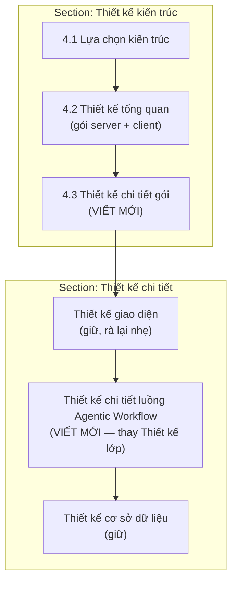

# Kế hoạch viết lại Chương 4 — §4.3 + Luồng Agentic Workflow

File LaTeX: [`4_Ket_qua_thuc_nghiem.tex`](ĐATN_20225919_Lê_Thái_Sơn_Chatbot_tư_vấn_luật_hôn_nhân_gia_đình/Chuong/4_Ket_qua_thuc_nghiem.tex)

Nguồn code bắt buộc: [`thesis-context/chat-flow.md`](thesis-context/chat-flow.md), [`thesis-context/architecture.md`](thesis-context/architecture.md), [`thesis-context/ch05-code-map.md`](thesis-context/ch05-code-map.md)

---

## 1. Cấu trúc Chương 4 sau khi sửa



### Thao tác cấu trúc LaTeX

| Hành động | Phạm vi hiện tại | Ghi chú |
|---|---|---|
| **Giữ** | §4.1, §4.2, Thiết kế giao diện, Thiết kế CSDL | §4.2 đã đồng bộ codebase |
| **Viết mới** | §4.3 (dòng 45–57 placeholder) | Module/component diagram |
| **Xóa hoàn toàn** | §4.4 (dòng 59–134) | Nội dung sai: Main Agent, 5 bước quá thô, bảng agent lỗi thời |
| **Xóa hoàn toàn** | `\subsection{Thiết kế lớp}` (dòng 168–253) | Hình/bảng main+router kiểu OOP; trùng vai trò với workflow |
| **Viết mới** | `\subsection{Thiết kế chi tiết luồng Agentic Workflow}` | Đặt **sau** Thiết kế giao diện, **trước** Thiết kế CSDL |
| **Xóa hình** | `Picture2.png`, `thiết kế chi tiết cho module main.png`, `thiết kế chi tiết cho module router.png` | Không còn tham chiếu |

**Luồng đọc cho hội đồng:** Kiến trúc macro (4.1–4.2) → Cấu trúc module (4.3) → UI (minh họa) → **Hành vi runtime Agentic** (workflow) → Dữ liệu (CSDL).

---

## 2. §4.3 — Thiết kế chi tiết gói

### 2.1 Nguyên tắc (thay hướng dẫn OOP template)

- Codebase Python **phân lớp + module/hàm**, không có class hierarchy nghiệp vụ.
- Biểu đồ dùng **hộp module/thành phần** + mũi tên **phụ thuộc** (import/gọi hàm), không vẽ inheritance giả.
- §4.3 mô tả **cấu trúc tĩnh** (ai nằm ở đâu, phụ thuộc ai) — **không** mô tả luồng runtime (để cho mục Agentic Workflow).

**Xóa:** placeholder dòng 46–50, Hình `Picture2.png`.

### 2.2 `\subsubsection{Gói presentation}`

**Hình:** `Hinhve/Chi tiết gói presentation.png`

| Module | Vai trò |
|---|---|
| `main.py` | Entry Chainlit: hooks, orchestrate router → merge context → stream LLM |
| `guest_auth.py` | `POST /auth/guest`, middleware chặn API quản lý hội thoại |
| `projects_api.py` | REST projects/threads (user đăng nhập) |
| `viz_routes.py` | HTTP GET dữ liệu subgraph cho vis-network |
| `compare_actions.py` | Action so sánh baseline (phụ) |

**Dependency chính (vẽ trên hình):** `main` → `application.router`, `legal_context`, `conversation_context`, `retriever_tools`; import side-effect `adapter.data_layer`; `guest_auth` → `adapter.guest`.

**Văn bản (~1 đoạn):** Presentation không truy vấn Neo4j; đăng ký 23 tool qua `build_presentation_tools()` (20 retriever + `clarify` + `respond` + `text2cypher`).

### 2.3 `\subsubsection{Gói application}`

**Hình:** `Hinhve/Chi tiết gói application.png`

| Module | Vai trò |
|---|---|
| `router.py` | Router Agent — tool-calling, execute/reuse retriever |
| `conversation_context.py` | Memory — `build_working_history`, `retrieval_memory`, anchor |
| `legal_context.py` | Merge/dedupe `LegalContextBundle`, render cho LLM |
| `retriever_catalog.py` | Metadata + trigger rules 20 retriever |
| `retriever_tools.py` | Connector: catalog + adapter callable → `tools` dict |
| `router_tool_registry.py` | Schema tool gửi LLM |
| `retriever_policy.py` | Helper benchmark (**không** cổng production) |
| `warning_payload.py` | Metadata cảnh báo pháp lý cho UI |
| `adapter_router_descriptions.py` | Map tool name → module description |

**Văn bản (~1 đoạn):** Tầng điều phối Agentic; cô lập presentation khỏi Neo4j/LLM config.

### 2.4 `\subsubsection{Gói adapter}`

**Hình:** `Hinhve/Chi tiết gói adapter.png` (2 tầng trên 1 hình)

**Tầng hạ tầng:** `config.py`, `data_layer.py`, `guest.py`, `direct_tools.py`, `graph_viz.py`, `text2cypher.py`

**Tầng retriever:** `retrievers/<domain>.py` (20 entry) ↔ `cypher_templates/<topic>/` (`TemplateRegistry`, `CypherTemplate`) ↔ `registry_index.py`

**Bảng — Pipeline chuẩn mỗi Retriever Agent:**

| Bước | Thành phần | I/O |
|---|---|---|
| Classify | LLM + `TemplateRegistry.descriptions()` | `query` → template name(s) |
| Extract | LLM + Pydantic `params_schema` | template → params + `thoi_diem_su_kien` |
| Execute | Neo4j `driver.execute_query` | params → `Context_Tho` |
| Encode | `utils/legal_context_codec.encode_context_record` | records → `LEGAL_CONTEXT_BUNDLE_V1:...` |

**Văn bản:** 1 ví dụ `dieu_kien_ket_hon.py`; bảng phụ gọn 20 tool (tên, file, topic template) từ `retriever-catalog.md`.

**Không mô tả:** `adapter/obsolete_retrievers/`.

### 2.5 `\subsubsection{Gói utils}`

Không bắt buộc hình riêng.

| Module | Vai trò |
|---|---|
| `utils.py` | `chuan_hoa_Context_cho_LLM`, tiện ích chuỗi/thời gian |
| `legal_context_codec.py` | Shared contract encode/decode bundle |

**Văn bản ngắn:** Gói thuần dữ liệu; không import ngược `application`/`presentation`.

### 2.6 Client

Chỉ 2–3 câu tham chiếu §4.2.2 — không lặp sơ đồ client.

---

## 3. Thiết kế chi tiết luồng Agentic Workflow (thay Thiết kế lớp)

Mục này mô tả **hành vi runtime** — bám [`chat-flow.md`](thesis-context/chat-flow.md). Thay thế hoàn toàn nội dung cũ §4.4 + Thiết kế lớp.

### 3.1 Những gì SAI trong bản cũ (cần sửa khi viết)

| Bản cũ | Thực tế code |
|---|---|
| "Main Agent" trung tâm | **Chat Orchestrator** = luồng `presentation/main.py` (không phải class Agent riêng) |
| 5 bước macro (User→Analyze→Tool→Retrieve→Response) | Pipeline chi tiết hơn: working history, audit routing, parallel tools, cache reuse, bundle merge, direct tool short-circuit |
| Router input: `updated_query` từ Query Updater | `build_working_history` + anchor; **`query_updater.py` không được gọi** |
| Retriever output: `List[Dict]` nodes | **`LEGAL_CONTEXT_BUNDLE_V1`** (và một số legacy text) |
| FallBack Tool cố định | Fallback **`text2cypher`** hoặc validation tool không tồn tại |
| Thiếu direct tool | **`clarify`**, **`respond`** (exclusive), **`text2cypher`** |
| Thiếu memory/dedupe | `retrieval_memory`, `context_action=reuse`, `process_context_strings` |
| `RetrieverPolicy` bắt buộc | Luồng chính **bypass** policy trong `route_question_with_audit` |

### 3.2 Cấu trúc nội dung đề xuất

```latex
\subsection{Thiết kế chi tiết luồng Agentic Workflow}
\label{subsection:agentic-workflow}

\subsubsection{Tổng quan kiến trúc Agentic GraphRAG}
\subsubsection{Vòng đời phiên hội thoại}
\subsubsection{Luồng xử lý một câu hỏi (on\_message)}
\subsubsection{Vai trò các thành phần điều phối}
\subsubsection{Bộ nhớ hội thoại và ngữ cảnh truy xuất}
\subsubsection{Tái sử dụng context (cache reuse)}
\subsubsection{Hợp nhất và khử trùng căn cứ pháp lý}
\subsubsection{Công cụ phản hồi trực tiếp}
\subsubsection{Biểu đồ trình tự}
```

---

### 3.3 Chi tiết từng `\subsubsection`

#### 3.3.1 Tổng quan kiến trúc Agentic GraphRAG

**Hình:** `Hinhve/Luồng Agentic GraphRAG.png` — **vẽ lại** (không dùng bản cũ nếu còn "Main Agent")

**Thành phần trên hình (component/activity):**

- User ↔ Frontend Chainlit
- Chat Orchestrator (`presentation/main.py`)
- Router Agent (`application/router.py`, gpt-4o)
- 20 Retriever Agents + 3 Direct Tools
- Memory Component (`conversation_context`)
- Context Merge (`legal_context`)
- Response LLM (gpt-4.1, stream trong `main`)
- Neo4j KG, LLM Gateway

**Đoạn văn (~1 đoạn):** Agentic GraphRAG = Router chọn tool theo mô tả schema + Retriever truy vấn KG bằng Cypher template + Response LLM tổng hợp có căn cứ.

**Không lặp:** bảng module §4.3.

---

#### 3.3.2 Vòng đời phiên hội thoại

**Nguồn:** `on_chat_start`, `on_chat_resume`, guest bootstrap

**Bảng — Hook Chainlit:**

| Hook | Hành vi | State khởi tạo/khôi phục |
|---|---|---|
| `on_chat_start` | Greeting, reset session | `session_history`, `retrieval_memory`, `conversation_anchors` = rỗng |
| `on_chat_resume` | User mở thread cũ (không guest) | `restore_conversation_state(steps)` từ PostgreSQL metadata |
| Guest bootstrap | `POST /auth/guest` | Cùng luồng chat in-memory; **không** persist thread/step |

**Ghi chú guest (1 đoạn ngắn):** Guest và user thật dùng cùng pipeline `on_message`; khác biệt ở persist (`adapter/data_layer.py`).

**Hình (tùy chọn):** activity diagram nhỏ lifecycle — hoặc gộp vào seq resume.

---

#### 3.3.3 Luồng xử lý một câu hỏi (`on_message`)

**Hình:** activity diagram hoặc numbered pipeline (khuyến nghị **bảng bước** + tham chiếu `main()`)

**Pipeline thực tế** (theo [`presentation/main.py`](presentation/main.py)):

| STT | Bước | Module | Mô tả |
|---|---|---|---|
| 1 | Nhận tin nhắn | `main` | `input_text`, lấy `session_history`, `retrieval_memory`, `conversation_anchors` |
| 2 | Dựng lịch sử Router | `conversation_context` | `build_working_history(..., ROUTER_HISTORY_MAX_TOKENS)` |
| 3 | Định tuyến + thực thi tool | `router` | `route_question_with_audit` → parallel `handle_tool_calls` |
| 4 | Ghi memory entries | `conversation_context` | `create_retrieval_memory_entries` |
| 5 | Gom context | `main` | Flatten `tool_response[*].contexts` |
| 6 | Direct answer? | `main` | Nếu `respond`/`clarify` trả 1 string → gửi thẳng, **bỏ qua** Response LLM |
| 7 | Merge/dedupe | `legal_context` | `process_context_strings` → `rendered_text` |
| 8 | Cảnh báo pháp lý | `warning_payload` | Metadata cho UI |
| 9 | Dựng lịch sử Response | `conversation_context` | `build_working_history(..., RESPONSE_HISTORY_MAX_TOKENS)` |
| 10 | Stream đáp án | `main` + `adapter/config.chat_stream` | LLM + `main_prompt` + context + history |
| 11 | Cập nhật session | `main` | Append user/assistant; lưu anchor; persist step metadata |

**Expert mode (1 câu):** `_route_with_optional_steps` tạo Chainlit steps Router/Retriever khi bật.

---

#### 3.3.4 Vai trò các thành phần điều phối

**Thay 3 bảng cũ (Main/Router/Retriever)** bằng **4 bảng** khớp code:

**Bảng A — Chat Orchestrator** (thay "Main Agent")

| Thành phần | Mô tả |
|---|---|
| Triển khai | `presentation/main.py` — hooks + `main()` |
| Chức năng | Điều phối end-to-end; stream Response LLM; persist trace |
| Đầu vào | User message; kết quả routing; session state |
| Prompt | `main_prompt` — quy tắc lập luận pháp lý, hiệu lực, cảnh báo xung đích |
| Đầu ra | Assistant message; metadata (`retrieval_memory_entries`, `turn_anchor`, warnings) |

**Bảng B — Router Agent**

| Thành phần | Mô tả |
|---|---|
| Triển khai | `application/router.py` — `route_question_with_audit`, `tool_choice` |
| LLM | gpt-4o, `bind_tools` |
| Đầu vào | `working_history`, câu hỏi hiện tại, danh sách 23 tool schema |
| Control fields | `confidence_score`, `context_action`, `context_refs`, `time_scope`, `target_date` (bị strip trước khi gọi retriever) |
| Validation | Tool tồn tại; dedupe tool call; reuse validation |
| Đầu ra | `tool_response[]`, routing metadata |

**Bảng C — Retriever Agent (mẫu chung, 20 domain)**

| Thành phần | Mô tả |
|---|---|
| Triển khai | `adapter/retrievers/*.py` — async function trùng tên tool |
| Pipeline | Classify → Extract → Execute → Encode (§4.3) |
| LLM | gpt-4o (classify + extract) |
| Đầu ra | `{"contexts": [...], "debug": ..., "resolved_query": ..., "cache_status": ...}` |

**Bảng D — Direct Tools**

| Tool | Hành vi | Exclusive? |
|---|---|---|
| `clarify` | Hỏi lại khi follow-up còn ≥2 cách hiểu | Có — không chạy retriever kèm |
| `respond` | Trả lời trực tiếp không cần KG | Có |
| `text2cypher` | Fallback Cypher tự do khi không khớp domain | Không exclusive |

**Không viết bảng riêng** cho Context Merge / Memory — chuyển sang 3.3.5–3.3.7.

---

#### 3.3.5 Bộ nhớ hội thoại và ngữ cảnh truy xuất

**Nguồn:** `application/conversation_context.py`

**Hình (tùy chọn):** sơ đồ 3 lớp memory

| Lớp | Cấu trúc | Mục đích |
|---|---|---|
| Session history | `session_history` / full history | Toàn bộ user + assistant turns |
| Working history | Recent full turns + compact anchors | Budget token cho Router/Response LLM |
| Retrieval memory | `dict[context_ref → entry]` | Cache bundle đã truy xuất theo turn |

**Bảng — Trường `retrieval_memory` entry:**

`context_ref`, `turn_id`, `thread_id`, `retriever_name`, `resolved_query`, `encoded_contexts`, `target_dates`, `kg_version`, `created_at`

**Biến môi trường (1 dòng):** `RECENT_FULL_TURNS`, `ROUTER_HISTORY_MAX_TOKENS`, `RESPONSE_HISTORY_MAX_TOKENS`, `KG_VERSION`.

**Ghi chú:** Không dùng Query Updater; Router tự giải tham chiếu follow-up qua working history + anchor.

---

#### 3.3.6 Tái sử dụng context (cache reuse)

**Nguồn:** `router.py` — `_reuse_tool_call`, `validate_reuse_request`

**Luồng mô tả (numbered list):**

1. Router đặt `context_action="reuse"` + `context_refs` khi follow-up không mở vấn đề pháp lý mới.
2. `validate_reuse_request` kiểm tra deterministic: cùng thread, retriever, kg_version, temporal scope, bundle parse được.
3. Pass → trả context cũ, `cache_status="reused"`; fail → gọi retriever thật, `cache_fallback_reason`.

**Bảng — Điều kiện reuse hợp lệ** (tóm từ chat-flow.md).

**UI mapping:** Expert mode hiển thị `Retriever cache: <name>` vs `Retriever: <name>`.

---

#### 3.3.7 Hợp nhất và khử trùng căn cứ pháp lý

**Nguồn:** `application/legal_context.py`

**Luồng (text diagram):**

```text
Context_Tho → encode → contexts[]
→ process_context_strings
→ group (target_date, is_user_provided_date)
→ merge bundles → render → chuan_hoa_Context_cho_LLM
```

**Bảng — Khóa dedupe provision:** `id + amendment_id + effective_from + effective_until`

**Ghi chú migration:** Mixed-compatible — retriever bundle vs legacy text; không khẳng định 100% đã migrate nếu code còn `chuan_hoa_Context_cho_LLM` trực tiếp.

---

#### 3.3.8 Công cụ phản hồi trực tiếp (clarify / respond)

**1 đoạn + bảng nhỏ:** Khi nào Router chọn; short-circuit ở bước 6 pipeline; không có step "Tổng hợp đáp án" trên UI.

---

#### 3.3.9 Biểu đồ trình tự

**Giữ/cập nhật:**

1. **Tư vấn pháp lý** — `biểu đồ trình tự use case tư vấn pháp lý.png`  
   - Participants: User, Frontend, `main`, Router, Retriever, Neo4j, `legal_context`, Response LLM  
   - Bổ sung: `process_context_strings`, parallel retriever nếu đa tool  
   - **Xóa** luồng "Router trả về main rồi mới gọi retriever" nếu sai thứ tự

2. **Khôi phục phiên** — bỏ comment, vẽ mới `seq_resume`  
   - User chọn thread → `on_chat_resume` → PostgreSQL steps → `restore_conversation_state`

3. **(Tùy chọn)** Follow-up cache reuse — seq ngắn Router reuse vs fallback

**Di chuyển:** Seq diagram **từ** block Thiết kế lớp cũ **sang** đây; giải thích văn bản đi kèm từng hình.

---

## 4. Phân tách nội dung — tránh trùng

| Chủ đề | §4.3 | Agentic Workflow | §4.2 |
|---|---|---|---|
| Tên module/file | Có (hình) | Chỉ khi mô tả bước runtime | Tên gói |
| Pipeline classify/extract | Bảng 4 bước | Retriever trong seq + bảng C | — |
| working_history / reuse | — | Đầy đủ | — |
| 20 retriever catalog | Bảng phụ gọn | Nhắc "20 domain" | Số lượng |
| UI agent trace | — | Expert mode mapping | § UI có screenshot |

---

## 5. Deliverables hình vẽ

| File drawio/PNG | Mục |
|---|---|
| `Chi tiết gói presentation` | §4.3 |
| `Chi tiết gói application` | §4.3 |
| `Chi tiết gói adapter` | §4.3 |
| `Luồng Agentic GraphRAG` (vẽ lại) | Workflow §3.3.1 |
| `biểu đồ trình tự use case tư vấn pháp lý` (cập nhật) | Workflow §3.3.9 |
| `seq_resume` (mới) | Workflow §3.3.9 |

Style: đồng bộ [`Kiến trúc tổng quan.drawio`](ĐATN_20225919_Lê_Thái_Sơn_Chatbot_tư_vấn_luật_hôn_nhân_gia_đình/Hinhve/Kiến trúc tổng quan.drawio).

---

## 6. Thứ tự triển khai

1. **Outline LaTeX** — xóa §4.4 + Thiết kế lớp; chèn skeleton Agentic Workflow.
2. **§4.3** — vẽ 3 diagram + viết text.
3. **Agentic Workflow** — vẽ lại luồng tổng quan + seq; viết 9 subsubsection.
4. **Cross-ref** — sửa mọi `\ref{subsection:4.4}`, `\ref{table: main_agent}`, `\ref{fig:main_detail}` trong chương/khác chương.
5. **`scripts/build-thesis.ps1`** — kiểm tra PDF.

---

## 7. Ước lượng độ dài (tham khảo)

| Mục | Subsubsection | Hình | Bảng |
|---|---|---|---|
| §4.3 | 4 | 3 | 1–2 |
| Agentic Workflow | 9 | 2–4 | 6–8 |
| **Xóa** | — | 3 (main/router/Picture2) | 5 (main/router cũ + 3 agent cũ) |
