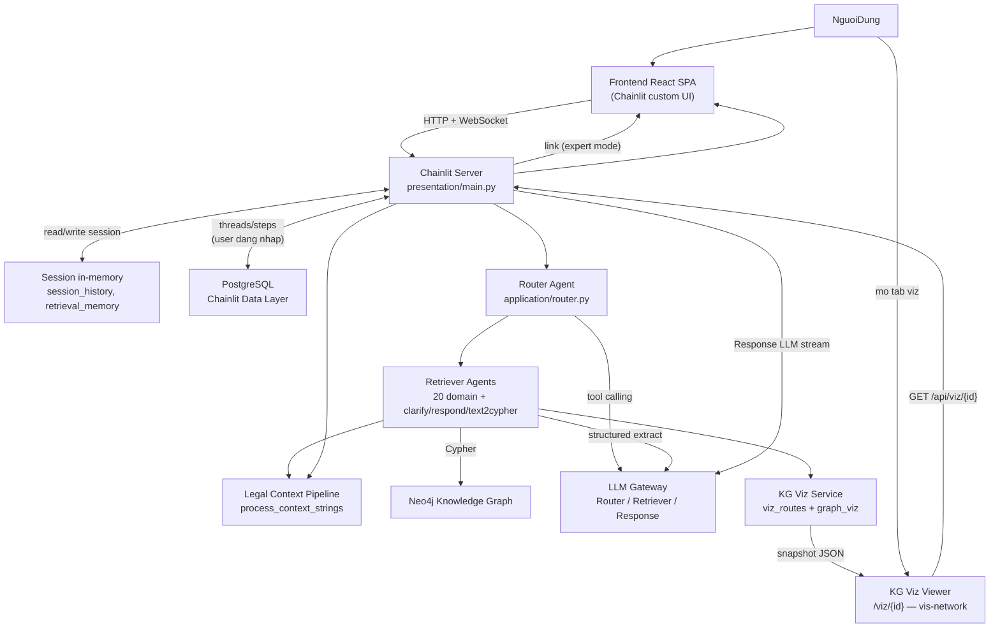

# Kế hoạch sửa §4.1 — Kiến trúc tổng quan (Chương 4)

Phạm vi lần này: [`4_Ket_qua_thuc_nghiem.tex`](ĐATN_20225919_Lê_Thái_Sơn_Chatbot_tư_vấn_luật_hôn_nhân_gia_đình/Chuong/4_Ket_qua_thuc_nghiem.tex) dòng 4–19 và file hình [`Hinhve/Kiến trúc tổng quan.png`](ĐATN_20225919_Lê_Thái_Sơn_Chatbot_tư_vấn_luật_hôn_nhân_gia_đình/Hinhve/Kiến trúc tổng quan.png). Nguồn code tham chiếu: [`thesis-context/architecture.md`](thesis-context/architecture.md), [`thesis-context/chat-flow.md`](thesis-context/chat-flow.md), [`presentation/main.py`](presentation/main.py), [`application/router.py`](application/router.py).

---

## Câu hỏi 1 — Sơ đồ kiến trúc có cần thay đổi không?

**Có.** Sơ đồ hiện tại vẫn đúng hướng client–server và luồng Question → Router → Retriever → KG → LLM, nhưng **lệch khái niệm và thiếu vài thành phần quan trọng** so với codebase 2026.

### Luồng thực tế (để đối chiếu khi vẽ lại)



### Bổ sung: Visualize Knowledge Graph — có, nhưng không nằm trong React chat

Hệ thống **có** tính năng visualize KG, nhưng **không embed trong React SPA chat** (`frontend/src/` không có component viz). Luồng thực tế:

1. Retriever chạy xong → [`adapter/graph_viz.py`](adapter/graph_viz.py) tạo snapshot (nodes/edges từ Neo4j + context).
2. Snapshot lưu qua [`adapter/viz_store.py`](adapter/viz_store.py).
3. Ở **chế độ chuyên gia** (`expert_mode`), [`_viz_footer()`](presentation/main.py) chèn link Markdown vào câu trả lời chat.
4. User bấm link → mở trang **`/viz/{viz_id}`** — HTML/JS tĩnh trong thư mục [`viz/`](viz/) (dùng **vis-network**), do backend phục vụ qua [`presentation/viz_routes.py`](presentation/viz_routes.py) (`/viz/{id}`, `/api/viz/{id}`, `/viz-assets/*`).

**Kết luận cho sơ đồ:** nên thể hiện visualize KG, nhưng **tách khỏi khối Chat UI** — đây là **giao diện phụ** (tab/trang riêng), không phải một phần của React chat client.

### Frontend — phần cần sửa trên draw.io

| Hiện tại trên hình | Code thực tế | Đề xuất trên hình mới |
|---|---|---|
| Khối chung **Chatbot Web UI** | SPA React tùy biến trong [`frontend/src/`](frontend/src/), build vào `public/chainlit-build/`, dùng `@chainlit/react-client` | Tách **2 khối con trong Frontend**: **(1) Giao diện chat (React SPA)** và **(2) KG Viz Viewer** (`/viz/{id}`, vis-network) |
| Không có viz | Viz là trang web riêng, user vào qua link từ chat (expert mode) | Mũi tên **Chat UI → link visualize → KG Viz Viewer**; Viz Viewer gọi **GET /api/viz/{id}** về backend |
| Không có xác thực | Guest: `POST /auth/guest` ([`presentation/guest_auth.py`](presentation/guest_auth.py)); user thật: OAuth ([`AppWrapper.tsx`](frontend/src/AppWrapper.tsx)) | Thêm khối phụ **Xác thực (OAuth / Guest JWT)** hoặc chú thích trên mũi tên đầu tiên |
| Chỉ HTTP/WebSocket | Chat: WebSocket; viz: HTTP GET trang tĩnh + REST JSON | Chat giữ **HTTP/WebSocket**; viz thêm **HTTP (trang /viz + API JSON)** |
| Không phân biệt guest vs user | Guest không persist thread/step ([`adapter/data_layer.py`](adapter/data_layer.py)) | Chú thích nhỏ: *sidebar lịch sử chỉ với user đăng nhập*; *link viz chỉ khi bật chế độ chuyên gia* |

**Không cần đổi:** actor User, ranh giới Frontend/Backend, kết nối real-time chat với server.

**Cách vẽ gợi ý trên draw.io (Frontend box):**

```text
┌─ Frontend ─────────────────────────────────────┐
│  [Giao diện chat — React SPA / Chainlit]       │
│  [KG Viz Viewer — /viz/{id} (tab riêng)]       │
└────────────────────────────────────────────────┘
         │ HTTP/WebSocket              │ HTTP GET
         └──────────────┬───────────────┘
                        ▼
                 Chainlit Server
```

### Backend — phần cần sửa trên draw.io

| Hiện tại trên hình | Code thực tế | Đề xuất trên hình mới |
|---|---|---|
| **Server-Backend** (mơ hồ) | Entry point: [`presentation/main.py`](presentation/main.py) — Chainlit hooks + FastAPI routes (guest, projects, viz) | Đổi thành **Chainlit Server / Presentation Layer** |
| **Main Agent** (xem Câu 2) | Hàm `@cl.on_message` điều phối tuần tự, không phải agent LLM riêng | **Bỏ nhãn "Agent"** → **Luồng điều phối chat** (hoặc *Chat Orchestrator*) |
| Main Agent → LLM một mũi tên | Có **3 vai LLM**: Router ([`ROUTER_LLM`](application/router.py)), Retriever extract ([`RETRIEVER_LLM`](adapter/retrievers/)), Response ([`chat_stream`](adapter/config.py)) qua Vercel AI Gateway | Khối ngoài **LLM Gateway**; từ Router, Retriever và Orchestrator各 có mũi tên riêng (hoặc 1 khối LLM với 3 nhãn con) |
| Retriever → KG (chỉ Cypher) | Pipeline 3 bước: classify → extract (LLM) → execute Cypher ([ví dụ `dieu_kien_ket_hon.py`](adapter/retrievers/ket_hon/dieu_kien_ket_hon.py)) | Thêm mũi tên **Retriever Agents → LLM** (trích xuất tham số) **và** **→ Neo4j** (Cypher) |
| **Retriever Router Agent** | [`application/router.py`](application/router.py), 20 retriever + 3 direct tool `clarify`, `respond`, `text2cypher` | Giữ; có thể chú thích *20 retriever + direct tools* |
| **Persistent Session Storage** (một DB) | **Hai lớp**: (1) in-memory Chainlit session; (2) PostgreSQL chỉ user đăng nhập | Tách hoặc chú thích: **Session runtime (in-memory)** + **PostgreSQL (persist thread/step)** |
| **Knowledge Graph** | Neo4j Aura/local, Bolt | Giữ; có thể ghi **Neo4j** |
| Thiếu bước hợp nhất context | [`process_context_strings`](application/legal_context.py) + `retrieval_memory` reuse | Thêm khối nhỏ **Legal Context Pipeline** giữa Retriever và Orchestrator (tùy mức chi tiết sơ đồ) |
| Thiếu KG visualization | [`presentation/viz_routes.py`](presentation/viz_routes.py) + [`adapter/graph_viz.py`](adapter/graph_viz.py) + [`viz/`](viz/) | Thêm khối backend **KG Viz Service** (tạo snapshot từ retriever/Neo4j, phục vụ `/viz`, `/api/viz`); nối với **KG Viz Viewer** phía client |

### Thứ tự luồng đề xuất trên hình mới

1. User → Frontend React (chat)
2. Frontend ↔ Chainlit Server (HTTP/WebSocket)
3. Server ↔ Session in-memory; Server ↔ PostgreSQL (có điều kiện)
4. Server → Router Agent → (LLM tool-calling) → Retriever Agents (song song)
5. Retriever → LLM extract → Neo4j → context bundles
6. Retriever → KG Viz Service → snapshot (song song với bước 5, khi có dữ liệu viz)
7. Server: merge/dedupe context → Response LLM stream → Chat UI (+ link viz nếu expert mode)
8. User mở link → KG Viz Viewer → GET `/api/viz/{id}` từ server → hiển thị đồ thị

---

## Câu hỏi 2 — Có nên giữ khối Main Agent không?

**Không nên gọi là "Agent" trên sơ đồ kiến trúc tổng quan**, vì trong code **không tồn tại một agent LLM tên Main Agent**.

Bằng chứng từ code:

- Entry orchestration nằm ở hàm `main()` trong [`presentation/main.py`](presentation/main.py) (`@cl.on_message`): đọc session → `build_working_history` → `route_question_with_audit` → gom context → `process_context_strings` → `chat_stream`.
- Đây là **pipeline điều phối imperative** (Python async), không có prompt/router loop riêng như Router.
- [`application/query_updater.py`](application/query_updater.py) **không** nằm trong luồng chính (`presentation/main.py` không gọi).

**Phân loại thành phần theo mức "agent":**

| Thành phần | Có phải agent? | Lý do |
|---|---|---|
| Router (`application/router.py`) | **Có** (agent LLM) | LLM tool-calling, chọn 1..n tool, `context_action`/`reuse` |
| Retriever (`adapter/retrievers/*`) | **Có** (domain agent) | LLM classify/extract + Cypher + encode bundle |
| Direct tools `clarify`, `respond`, `text2cypher` | Một phần | `clarify`/`respond` trả thẳng; `text2cypher` fallback |
| `main()` / presentation | **Không** | Orchestrator/server handler |

**Khuyến nghị cho đồ án:**

- **Sơ đồ tổng quan (Fig0):** dùng **"Luồng điều phối chat"** hoặc **"Chat Orchestrator (presentation/main.py)"** — không dùng "Main Agent".
- **§4.4 và bảng `table:main_agent` (dòng 69+):** vẫn có thể giữ khái niệm *tác nhân điều phối* nếu bạn muốn thống nhất thuật ngữ Agentic GraphRAG, **nhưng cần sửa mô tả**: đây là *lớp điều phối* ánh xạ tới `presentation/main.py`, không phải agent LLM độc lập. Lần sửa tiếp theo nên đồng bộ §4.4 để tránh mâu thuẫn Fig0 vs bảng đặc tả.

---

## Câu hỏi 3 — Mô tả văn bản (dòng 17–19) nên sửa thế nào

### Đoạn dẫn hình (dòng 9) — sửa nhẹ

Thay *"2 phần frontend... backend"* bằng mô tả chính xác hơn: client React/Chainlit và server Chainlit điều phối Agentic GraphRAG.

### Đoạn frontend (dòng 17) — bản đề xuất

> Phía frontend gồm hai giao diện người dùng. **Giao diện chat** xây dựng trên **React SPA tùy biến** và thư viện **Chainlit React Client**, cho phép đặt câu hỏi, xem câu trả lời streaming và theo dõi các bước Router/Retriever khi bật chế độ chuyên gia. **Giao diện visualize đồ thị tri thức** là trang web riêng (`/viz/{id}`) dùng thư viện vis-network; người dùng mở qua link trong câu trả lời (chế độ chuyên gia) để xem các nút và quan hệ pháp lý được retriever truy xuất. Chat duy trì **HTTP/WebSocket** với server; trang viz gọi **HTTP GET** tới API snapshot. Người dùng truy cập dưới dạng **khách (guest)** hoặc **đăng nhập OAuth**; guest chỉ dùng phiên hiện tại, user đăng nhập có sidebar quản lý hội thoại.

### Đoạn backend (dòng 19) — bản đề xuất

> Phía backend gồm **Chainlit server** ([`presentation/main.py`](presentation/main.py)) điều phối luồng Agentic GraphRAG: quản lý session hội thoại, gọi Router/Retriever, hợp nhất căn cứ pháp lý và sinh câu trả lời. Các thành phần chính: **(i) Luồng điều phối chat** — nhận tin nhắn, duy trì `session_history`, `retrieval_memory`, gọi Router, hợp nhất context qua `LegalContextBundle`, stream câu trả lời từ Response LLM; **(ii) Router Agent** — LLM tool-calling chọn một hoặc nhiều retriever/direct tool (`clarify`, `respond`, `text2cypher`) và hỗ trợ tái sử dụng context; **(iii) Retriever Agents** — 20 retriever theo domain pháp lý, mỗi retriever trích xuất tham số bằng LLM rồi truy vấn Cypher; **(iv) Neo4j Knowledge Graph** — đồ thị Luật Hôn nhân và Gia đình 2014; **(v) Dịch vụ visualize KG** — [`adapter/graph_viz.py`](adapter/graph_viz.py) tạo snapshot từ kết quả retriever, [`presentation/viz_routes.py`](presentation/viz_routes.py) phục vụ trang `/viz/{id}` và API JSON cho giao diện viz; **(vi) Lưu trữ phiên** — bộ nhớ runtime của Chainlit và **PostgreSQL** (Chainlit Data Layer) lưu thread/step cho user đăng nhập; **(vii) LLM Gateway** — dịch vụ LLM bên ngoài phục vụ Router, Retriever và Response.

**Lỗi nhỏ cần sửa khi chèn:** dấu `..` kép ở cuối câu hiện tại (`pháp lý..`).

### Đoạn §4.1.1 (dòng 7) — giữ, không cần đổi lớn

Đoạn client–server (dòng 7) vẫn phù hợp; chỉ cần đảm bảo câu dẫn hình (dòng 9) và 2 đoạn mô tả (17–19) thống nhất với hình mới.

---

## Checklist thực hiện (thứ tự đề xuất)

1. **Vẽ lại** [`Kiến trúc tổng quan.png`](ĐATN_20225919_Lê_Thái_Sơn_Chatbot_tư_vấn_luật_hôn_nhân_gia_đình/Hinhve/Kiến trúc tổng quan.png) trên draw.io theo bảng thay đổi ở Câu 1 (ưu tiên: bỏ Main Agent, tách PostgreSQL vs session memory, thêm LLM Gateway đa vai, Retriever → LLM + Neo4j).
2. **Sửa LaTeX** dòng 9, 17, 19 trong [`4_Ket_qua_thuc_nghiem.tex`](ĐATN_20225919_Lê_Thái_Sơn_Chatbot_tư_vấn_luật_hôn_nhân_gia_đình/Chuong/4_Ket_qua_thuc_nghiem.tex) theo bản đề xuất Câu 3.
3. **Build kiểm tra:** `powershell -File scripts/build-thesis.ps1`.
4. **Ghi chú phạm vi sau:** §4.4 (dòng 67, 73, bảng Main Agent) vẫn dùng thuật ngữ cũ — nên sửa ở lượt tiếp theo khi bạn tới mục Agentic Workflow để tránh Fig0 và §4.4 mâu thuẫn.

---

## Rủi ro / lưu ý đồ án

- Không mô tả `query_updater` là bước chính (đúng với code).
- Không gọi `RetrieverPolicy` là filter bắt buộc trên production path.
- Số retriever: **20** + 3 direct tool (theo [`thesis-context/ch05-code-map.md`](thesis-context/ch05-code-map.md)).
- Guest chat: nhấn mạnh không persist PostgreSQL — tránh đọc như mọi session đều ghi DB.

---

## Thực tế vẽ trên sơ đồ

> Phần này ghi lại nội dung **đã vẽ thực tế** trong [`Kiến trúc tổng quan.drawio`](ĐATN_20225919_Lê_Thái_Sơn_Chatbot_tư_vấn_luật_hôn_nhân_gia_đình/Hinhve/Kiến trúc tổng quan.drawio) và bản mô tả backend tương ứng (dòng 19). Export lại `Kiến trúc tổng quan.png` từ draw.io trước khi build PDF.

### Các khối trên sơ đồ

**Frontend (khung nét đứt):**

| Khối | Nhãn trên hình |
|---|---|
| Nhãn vùng | Frontend |
| Giao diện chính | Giao diện chat (React SPA / Chainlit) |
| Giao diện phụ | KG Viz Viewer (/viz/{id}) |

**Backend (khung nét đứt):**

| Khối | Nhãn trên hình |
|---|---|
| Nhãn vùng | Backend |
| Entry server | Chainlit Server |
| Điều phối | Luồng điều phối chat |
| Agent định tuyến | Retriever Router Agent |
| Agent truy xuất | Retriever Agents |
| Cơ sở dữ liệu phiên | Session Storage |
| Đồ thị tri thức | Knowledge Graph (Neo4j) |

**Bên ngoài Backend (3 khối LLM — hình trụ):**

| Khối | Nhãn trên hình | Gắn với |
|---|---|---|
| LLM sinh câu trả lời | Response LLM | Luồng điều phối chat |
| LLM định tuyến | Router LLM | Retriever Router Agent |
| LLM trích xuất | Retriever LLM | Retriever Agents |

**Không có trên hình (theo yêu cầu):** khối xác thực; chú thích guest/user; khối Legal Context Pipeline.

### Các mũi tên và nhãn luồng

| Từ | Đến | Nhãn |
|---|---|---|
| User | Giao diện chat | Request |
| User | KG Viz Viewer | Mở link viz (nét đứt) |
| Giao diện chat | Chainlit Server | HTTP/WebSocket (hai chiều) |
| KG Viz Viewer | Chainlit Server | GET /api/viz/{id} (nét đứt) |
| Giao diện chat | KG Viz Viewer | Link visualize (nét đứt) |
| Chainlit Server | Luồng điều phối chat | Question |
| Luồng điều phối chat | Chainlit Server | Answer |
| Luồng điều phối chat | Retriever Router Agent | Question |
| Retriever Router Agent | Luồng điều phối chat | Context đã được chuẩn hóa |
| Retriever Router Agent | Retriever Agents | Question |
| Retriever Agents | Retriever Router Agent | Context đã được chuẩn hóa |
| Retriever Router Agent | Router LLM | Tool calling (hai chiều) |
| Retriever Agents | Retriever LLM | Structured extract (hai chiều) |
| Retriever Agents | Knowledge Graph | Cypher query (hai chiều) |
| Luồng điều phối chat | Response LLM | Prompt + context đã chuẩn hóa (hai chiều) |
| Chainlit Server | Session Storage | Session read/write (hai chiều) |

**Lưu ý:** Chuẩn hóa context (`process_context_strings`, `LegalContextBundle`) không vẽ thành khối riêng; thể hiện qua nhãn mũi tên **Context đã được chuẩn hóa** từ Retriever → Router → Luồng điều phối, và **Prompt + context đã chuẩn hóa** khi gọi Response LLM.

### Mô tả thực tế dòng 19 (backend) — bản dùng cho LaTeX

Phía backend gồm **Chainlit server** điều phối luồng Agentic GraphRAG: tiếp nhận yêu cầu từ frontend, quản lý session hỏi đáp, gọi các agent truy xuất và sinh câu trả lời có căn cứ pháp lý. Các thành phần chính: **(i) Chainlit Server** — entry point HTTP/WebSocket, phục vụ giao diện chat, API snapshot visualize và ghi/đọc session; **(ii) Luồng điều phối chat** — nhận câu hỏi, duy trì lịch sử hội thoại và bộ nhớ truy xuất, gọi Router, hợp nhất context đã chuẩn hóa và stream câu trả lời từ Response LLM; **(iii) Retriever Router Agent** — phân tích câu hỏi, dùng Router LLM (tool calling) để chọn một hoặc nhiều retriever/direct tool phù hợp; **(iv) Retriever Agents** — dùng Retriever LLM trích xuất tham số, thực thi truy vấn Cypher và trả về context đã chuẩn hóa; **(v) Knowledge Graph (Neo4j)** — đồ thị tri thức Luật Hôn nhân và Gia đình 2014; **(vi) Session Storage** — lưu lịch sử hỏi đáp, input/output của agent, context truy xuất, câu trả lời và metadata phục vụ truy vết, kiểm thử và đánh giá; **(vii) Response LLM, Router LLM, Retriever LLM** — ba lần gọi API LLM bên ngoài tương ứng sinh câu trả lời, định tuyến công cụ và trích xuất tham số truy vấn.

### Mô tả thực tế dòng 17 (frontend) — tham khảo khi sửa LaTeX

Phía frontend gồm **giao diện chat** (React SPA tùy biến trên Chainlit React Client) cho phép đặt câu hỏi, xem câu trả lời streaming và các bước xử lý Router/Retriever; và **KG Viz Viewer** — trang `/viz/{id}` mở qua link visualize trong chat để xem đồ thị nút–cạnh pháp lý. Frontend duy trì HTTP/WebSocket với Chainlit server; trang viz gọi HTTP GET tới API snapshot.
