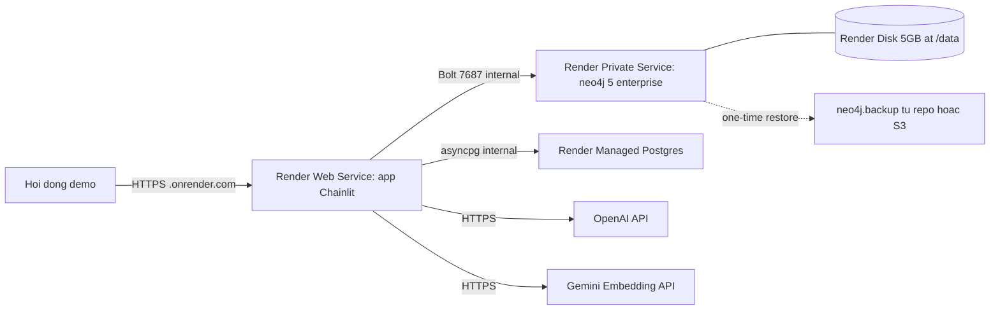

# Kế hoạch deploy Docker + Render.com

## 1. Bối cảnh

Stack hiện tại (đã verify từ codebase):

- **Backend Python**: Chainlit `2.11.1` chạy `presentation/main.py` ở port 8000, đăng ký tools qua `application/retriever_tools.py`, FastAPI app được mở rộng (`presentation.projects_api`, `presentation.viz_routes`, `presentation.guest_auth`).
- **Frontend React tùy biến**: đã build và commit sẵn ở [`public/chainlit-build/`](public/chainlit-build/) (Chainlit serve qua `custom_build = "./public/chainlit-build"` trong [`.chainlit/config.toml`](.chainlit/config.toml)). Không cần build lại khi deploy.
- **Persistence**: PostgreSQL (Chainlit data layer) qua `DATABASE_URL` trong [`adapter/config.py`](adapter/config.py).
- **KG**: Neo4j Bolt qua `NEO4J_URI` (xem [`adapter/config.py`](adapter/config.py)). Hiện đang dùng **AuraDB Free**, có file snapshot `.backup` cần restore sang container tự host.
- **LLM**: OpenAI + Gemini embedding qua API key.
- **Docker hiện có**: [`docker-compose.yml`](docker-compose.yml) mới có `db` (postgres:15) + `pgadmin`. Chưa có Dockerfile cho app và chưa có Neo4j.

## 2. Xử lý file `.backup` AuraDB

AuraDB Free dùng **Neo4j Enterprise** dưới hood. File `.backup` là output của `neo4j-admin database backup` (Enterprise online backup), KHÔNG load được bằng Community edition.

→ Phải dùng image **`neo4j:5-enterprise`** với env `NEO4J_ACCEPT_LICENSE_AGREEMENT=yes` (Neo4j Developer License — miễn phí cho non-commercial/academic, kể cả thesis defense + production demo cá nhân).

Lệnh restore (Enterprise):
```
neo4j-admin database restore --from-path=/snapshots --database=neo4j --overwrite-destination=true
```

Init script `deploy/neo4j/init-restore.sh` auto-detect:
- File `*.backup` → dùng `restore`
- File `*.dump` → dùng `load`
- Sau khi restore thành công, ghi sentinel `/data/.restored` để không chạy lại lần boot sau.

## 3. Kiến trúc deploy trên Render



- **app** (Web Service): public HTTPS, autoscale 1 instance Standard.
- **neo4j** (Private Service): chỉ accessible từ services khác trong cùng Render workspace qua hostname `neo4j`.
- **db** (Managed Postgres): connection string inject qua `fromDatabase` trong Blueprint.

## 4. File sẽ tạo / sửa

### Tạo mới

- **[`Dockerfile`](Dockerfile)** (root): single-stage build cho app Chainlit
  - Base `python:3.11-slim`, `apt-get install build-essential libpq-dev` (cho `psycopg2-binary` + `asyncpg`), `pip install -r requirements.txt`.
  - `COPY . /app` (tin `.dockerignore` loại trừ phần thừa); giữ `public/chainlit-build/`.
  - `ENV PORT=8000`, `EXPOSE 8000`, `CMD ["chainlit", "run", "presentation/main.py", "--host", "0.0.0.0", "--port", "8000", "--headless"]`.
- **[`.dockerignore`](.dockerignore)**: chặn `data/`, `benchmark_dataset/`, `extraction/`, `.git/`, `.venv/`, `venv/`, `.tmp/`, `tmp/`, `__pycache__/`, `*.log`, `ĐATN_*/`, `.env`, `.files/`, `frontend/node_modules/`, `*.backup`, `*.dump`, `viz/`, `tests/`.
- **[`deploy/neo4j/init-restore.sh`](deploy/neo4j/init-restore.sh)**:
  ```bash
  #!/bin/bash
  set -e
  if [ ! -f /data/.restored ] && ls /snapshots/*.backup /snapshots/*.dump 2>/dev/null | head -n1; then
    SNAP=$(ls /snapshots/*.backup /snapshots/*.dump 2>/dev/null | head -n1)
    case "$SNAP" in
      *.backup) neo4j-admin database restore --from-path=/snapshots --database=neo4j --overwrite-destination=true ;;
      *.dump)   neo4j-admin database load neo4j --from-path=/snapshots --overwrite-destination=true ;;
    esac
    touch /data/.restored
  fi
  exec /startup/docker-entrypoint.sh neo4j
  ```
- **[`deploy/neo4j/Dockerfile`](deploy/neo4j/Dockerfile)**: tiny wrapper image
  ```dockerfile
  FROM neo4j:5-enterprise
  COPY init-restore.sh /init-restore.sh
  RUN chmod +x /init-restore.sh
  ENTRYPOINT ["/init-restore.sh"]
  ```
- **[`render.yaml`](render.yaml)**:
  ```yaml
  databases:
    - name: chainlit-db
      plan: starter
      databaseName: chainlit_db
      user: chainlit
  services:
    - type: pserv
      name: neo4j
      runtime: docker
      plan: standard
      dockerfilePath: ./deploy/neo4j/Dockerfile
      dockerContext: ./deploy/neo4j
      disk:
        name: neo4j-data
        mountPath: /data
        sizeGB: 5
      envVars:
        - key: NEO4J_AUTH
          generateValue: true
        - key: NEO4J_ACCEPT_LICENSE_AGREEMENT
          value: "yes"
        - key: NEO4J_server_memory_heap_max__size
          value: 1G
        - key: NEO4J_server_memory_pagecache_size
          value: 512m
    - type: web
      name: app
      runtime: docker
      plan: standard
      dockerfilePath: ./Dockerfile
      healthCheckPath: /
      envVars:
        - key: OPENAI_API_KEY
          sync: false   # set manually in dashboard
        - key: GOOGLE_API_KEY
          sync: false
        - key: CHAINLIT_AUTH_SECRET
          generateValue: true
        - key: NEO4J_URI
          value: bolt://neo4j:7687
        - key: NEO4J_USERNAME
          value: neo4j
        - key: NEO4J_PASSWORD
          fromService: { type: pserv, name: neo4j, envVarKey: NEO4J_AUTH }   # parse "neo4j/<pwd>"
        - key: NEO4J_DATABASE
          value: neo4j
        - key: DATABASE_URL
          fromDatabase: { name: chainlit-db, property: connectionString }
        - key: RESPONSE_LLM
          value: gpt-4.1
        - key: ROUTER_LLM
          value: gpt-4o
        - key: RETRIEVER_LLM
          value: o3
        - key: EMBEDDING_MODEL
          value: gemini-embedding-001
        - key: EMBEDDING_DIMENSIONS
          value: "768"
        - key: NEO4J_VECTOR_INDEX
          value: che_do_tai_san_semantic_embedding
        - key: KG_VERSION
          value: 2026-06-11.1
  ```
- **[`docs/deploy.md`](docs/deploy.md)**: hướng dẫn dài, ngoài thesis (xử lý `.backup`, troubleshooting Render build, custom domain, log).

### Sửa

- **[`docker-compose.yml`](docker-compose.yml)**: thêm services `app` (build từ Dockerfile root) + `neo4j` (build từ `deploy/neo4j/Dockerfile`, mount `./deploy/neo4j/snapshots:/snapshots`, volume `neo4j_data:/data`), healthcheck cho `db` và `neo4j`, `depends_on` với condition `service_healthy`. Đây là môi trường dev/test trước khi push Render.
- **[`.env.example`](.env.example)**: thêm 2 nhóm — "PROD docker compose local" và "Render production note".
- **[`.gitignore`](.gitignore)**: cho phép `!docs/deploy.md`; bổ sung `deploy/neo4j/snapshots/*.backup`, `deploy/neo4j/snapshots/*.dump` (file lớn không commit trực tiếp trừ khi LFS).
- **[`ĐATN_.../Chuong/4_Ket_qua_thuc_nghiem.tex`](ĐATN_20225919_Lê_Thái_Sơn_Chatbot_tư_vấn_luật_hôn_nhân_gia_đình/Chuong/4_Ket_qua_thuc_nghiem.tex)** dòng 726–727: thay placeholder bằng section đầy đủ (chi tiết §6).

## 5. Chiến lược đẩy file `.backup` lên Render

Render không có UI upload file trực tiếp vào private service. 3 lựa chọn theo size:

| Size `.backup` | Phương án | Note |
|---|---|---|
| < 100 MB | Commit trực tiếp vào `deploy/neo4j/snapshots/` | Đơn giản nhất, file nằm trong git history |
| 100 MB – 2 GB | Git LFS (`git lfs track "*.backup"`) | Render hỗ trợ LFS sẵn, không cần config |
| > 2 GB | Upload S3/Google Drive (link công khai) + thêm bước `curl` trong `init-restore.sh` trước khi restore | Tránh bloat git, cần secret URL |

Bước "kg_upload_strategy" trong todos sẽ chọn 1 trong 3 dựa trên dung lượng thực tế (user check `ls -lh deploy/neo4j/snapshots/*.backup`).

## 6. Nội dung `\section{Triển khai}` (Chương 4)

Cấu trúc đề xuất, viết tiếng Việt theo phong cách UET/ĐATN, thay 2 dòng placeholder hiện tại (~3–4 trang sau khi xuất PDF):

### 6.1 Mô hình triển khai (1 đoạn + 1 hình)

Mô tả ngắn 3-service architecture trên Render với sơ đồ Mermaid/TikZ hoặc `\includegraphics` (sinh viên export từ draw.io). Nhấn mạnh:

- App container public HTTPS qua subdomain `.onrender.com` (TLS tự động).
- Neo4j chạy private service nội bộ workspace, không expose ra Internet.
- Postgres dùng Render Managed Database với connection string inject qua Blueprint.

### 6.2 Cấu hình hạ tầng (bảng)

```latex
\begin{table}[H]
\centering
\begin{tabular}{|l|l|l|l|}
\hline
\textbf{Service} & \textbf{Render plan} & \textbf{RAM/CPU} & \textbf{Ghi chú} \\ \hline
app (Chainlit)  & Standard         & 2 GB / 1 vCPU  & Public Web Service \\ \hline
neo4j           & Standard + Disk 5GB & 2 GB / 1 vCPU & Private Service, Enterprise \\ \hline
postgres        & Starter          & 256 MB / shared & Managed DB, 1 GB storage \\ \hline
\end{tabular}
\caption{Cấu hình hạ tầng Render.com}
\label{table:render_infra}
\end{table}
```
Chi phí tham chiếu: ~57 USD/tháng (app $25 + neo4j $25 + disk $1.25 + db $7).

### 6.3 Hướng dẫn các bước người dùng cần làm

Chia thành **5 phase tuần tự** (\begin{enumerate}\item kèm sub-step \begin{itemize}):

**Phase 1 — Chuẩn bị repo local**
- Cài Docker Desktop 24+ và Git LFS (`git lfs install`).
- Clone repo: `git clone <repo-url> && cd "Agentic GraphRAG Chatbot luật"`.
- Tải file `neo4j.backup` từ AuraDB console (Settings → Snapshots → Download), đặt vào `deploy/neo4j/snapshots/`.
- Nếu file > 100 MB: chạy `git lfs track "deploy/neo4j/snapshots/*.backup"` và commit `.gitattributes`.

**Phase 2 — Test stack ở local**
- Copy `.env.example` → `.env`, điền `OPENAI_API_KEY`, `GOOGLE_API_KEY`, `CHAINLIT_AUTH_SECRET` (random 32 ký tự).
- Chạy `docker compose up -d --build`. Lần đầu Neo4j tự restore từ `.backup` (~1–3 phút), Chainlit tự tạo schema PostgreSQL.
- Kiểm tra `docker compose logs neo4j` xác nhận log `Database restored`; `docker compose logs app` thấy `Your app is available at http://0.0.0.0:8000`.
- Mở browser `http://localhost:8000`, test 1–2 câu hỏi để verify retriever + KG.

**Phase 3 — Push GitHub + tạo Render Blueprint**
- Tạo repo private trên GitHub (không nên public vì có thể chứa snapshot KG).
- `git add . && git commit -m "Add Docker + Render deploy" && git push -u origin main`.
- Đăng ký tài khoản Render.com, link GitHub account (cho phép truy cập repo).
- Dashboard → New → Blueprint → chọn repo → Render auto-detect `render.yaml` → "Apply".

**Phase 4 — Cấu hình secrets**

Trong Render dashboard, sau khi Blueprint deploy xong vào service `app` → Environment:

```latex
\begin{table}[H]
\centering
\begin{tabular}{|l|l|}
\hline
\textbf{Env var} & \textbf{Cách điền} \\ \hline
OPENAI\_API\_KEY  & Paste key từ https://platform.openai.com/api-keys \\ \hline
GOOGLE\_API\_KEY  & Paste Gemini key từ Google AI Studio \\ \hline
CHAINLIT\_AUTH\_SECRET & Render auto-generate (không sửa) \\ \hline
NEO4J\_PASSWORD   & Lấy từ service neo4j → Environment → NEO4J\_AUTH (định dạng neo4j/\textit{pwd}) \\ \hline
\end{tabular}
\caption{Bảng env vars secrets trên Render}
\label{table:render_secrets}
\end{table}
```

**Phase 5 — Verify production + (tùy chọn) custom domain**
- Đợi build (~5–10 phút). Mở URL `https://<app-name>.onrender.com`.
- Theo dõi log: Render dashboard → service app → Logs; service neo4j → check `Database restored`.
- Nếu có domain riêng: Settings → Custom Domains → add → cập nhật CNAME ở DNS provider.

### 6.4 Kết quả thực nghiệm triển khai

Đoạn cuối với placeholder `% TODO sinh viên điền số liệu thực tế`:

- Số người dùng test (vd. N giảng viên + sinh viên trong phòng lab).
- Thời gian phản hồi trung bình từ Chainlit log (router + retriever + response stream).
- Dung lượng KG sau restore (`du -sh /data` trong neo4j container).
- Tỉ lệ uptime quan sát được (Render dashboard có biểu đồ).
- Giới hạn rate-limit OpenAI: với plan Tier 1 (~500 RPM gpt-4o), chịu được ~8 req/s đồng thời.

## 7. Lưu ý kỹ thuật

- `public/chainlit-build/` BẮT BUỘC nằm trong image (KHÔNG ignore trong `.dockerignore`).
- `neo4j:5-enterprise` cần `NEO4J_ACCEPT_LICENSE_AGREEMENT=yes` — chỉ hợp lệ cho non-commercial/academic; ghi rõ trong `docs/deploy.md`.
- `.backup` AuraDB phải cùng major version Neo4j (5.x) với target container — hiện cả 2 đều 5.x nên OK.
- `CHAINLIT_AUTH_SECRET` trong PROD phải khác `change-me-...` (Render auto-gen qua `generateValue: true`).
- Render Postgres Free hết hạn sau 90 ngày → plan dùng Starter $7/mo ngay từ đầu (đã có trong `render.yaml`).
- App service Standard 2GB là minimum để chứa được model client + Python runtime + Chainlit; Starter 512MB sẽ OOM.
- Neo4j Standard 2GB heap 1GB là minimum cho KG hôn nhân gia đình hiện tại (~hàng chục nghìn nodes).
- `fromService` cho `NEO4J_PASSWORD` cần parse từ `NEO4J_AUTH` format `neo4j/<pwd>` — có thể phải override thủ công nếu Render không support parsing.
- Không động vào code Python; chỉ thêm config deploy + viết section thesis.

## 8. Không trong scope

- Không thay đổi logic Router/Retriever/LegalContext (ngoài việc đọc env vars vốn đã hỗ trợ).
- Không build lại frontend Chainlit (dùng bundle commit sẵn ở `public/chainlit-build/`).
- Không tự động hoá pipeline `scripts/build_kg_*.py` trong container (dữ liệu thô `data/` không vào image).
- Không setup CI/CD GitHub Actions (Render auto-deploy on push đã đủ).
- Không setup monitoring/alerting nâng cao (Datadog/Sentry — Render có log + metrics cơ bản).