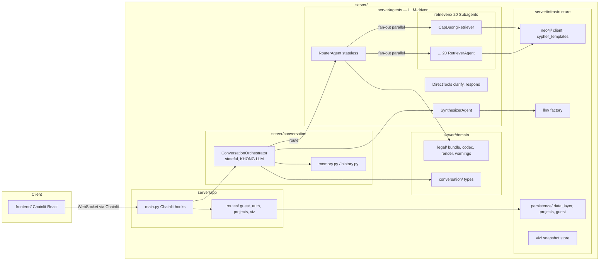
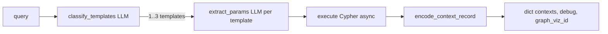

# Refactor server theo Router + Subagents pattern

## 1. Pattern lựa chọn

Bài LangChain: [Choosing the Right Multi-Agent Architecture](https://www.langchain.com/blog/choosing-the-right-multi-agent-architecture)

Codebase hiện tại khớp **Router (top-level) + Subagents (mid-level)**:
- 20 distinct verticals (legal domains) — checklist của Router (⭐⭐⭐⭐⭐ Parallelization, ⭐⭐⭐ Distributed dev).
- `application/router.py` đã làm: decompose → parallel `asyncio.gather` → synthesize.
- Mỗi retriever trong `adapter/retrievers/` là 1 mini-supervisor: classify Cypher template → extract params → execute → encode → đúng định nghĩa Subagents (centralized control, stateless, context isolation).
- `session_history` / `retrieval_memory` / `conversation_anchors` chính là gợi ý "wrap router as a tool within a stateful conversational agent" của blog. Bài LangChain liệt kê **hai cách bọc** Router stateless: (a) *Tool wrapper* — conversational agent LLM-driven gọi router như một tool; (b) *External state management* — lớp deterministic giữ state, gọi router theo lifecycle cố định. Hệ thống chọn **cách (b)**: lớp `ConversationOrchestrator` không có LLM riêng, không kế thừa `Agent`. Mọi suy luận ngôn ngữ tập trung ở `RouterAgent`, `RetrieverAgent` và `SynthesizerAgent`.

## 2. Kiến trúc mục tiêu



Subagents bên trong 1 retriever (ví dụ `CapDuongRetriever`):



## 3. Mapping file-by-file

### App layer (Chainlit composition)
- [presentation/main.py](presentation/main.py) -> [server/app/main.py](server/app/main.py) (chỉ Chainlit hooks + mount routes); business logic chuyển vào `ConversationOrchestrator` (ở `server/conversation/`).
- [presentation/guest_auth.py](presentation/guest_auth.py) -> [server/app/routes/guest_auth.py](server/app/routes/guest_auth.py)
- [presentation/projects_api.py](presentation/projects_api.py) -> [server/app/routes/projects.py](server/app/routes/projects.py)
- [presentation/viz_routes.py](presentation/viz_routes.py) -> [server/app/routes/viz.py](server/app/routes/viz.py)

### Agents layer
- [application/router.py](application/router.py) -> chia thành:
  - `server/agents/router/agent.py` — `RouterAgent.decide()` (LLM tool-pick) + `RouterAgent.dispatch()` (parallel `_execute_or_reuse_tool_call`).
  - `server/agents/router/prompt.py` — `tool_picker_prompt`.
  - `server/agents/router/schema.py` — `_router_tool_descriptions`, `RETRIEVER_QUERY_PARAM_DESCRIPTION`, `ROUTER_ONLY_ARGS`, `_with_router_confidence_schema`, `_CONTROL_ARGS`.
  - `server/agents/router/reuse.py` — `_reuse_tool_call`, `_execute_or_reuse_tool_call`, `_render_retriever_contexts_for_ui` (deterministic logic, không tạo state).
- [application/retriever_catalog.py](application/retriever_catalog.py) -> [server/agents/router/catalog.py](server/agents/router/catalog.py) (`RetrieverSpec`, `RETRIEVER_SPECS`, trigger rules — không đổi nội dung).
- [application/retriever_tools.py](application/retriever_tools.py) -> [server/agents/router/tool_factory.py](server/agents/router/tool_factory.py) (`build_presentation_tools`).
- [application/router_tool_registry.py](application/router_tool_registry.py) -> [server/interface/router_tools.py](server/interface/router_tools.py).
- [application/adapter_router_descriptions.py](application/adapter_router_descriptions.py) -> [server/agents/retrievers/_descriptions.py](server/agents/retrievers/_descriptions.py).
- [application/conversation_context.py](application/conversation_context.py) -> chia thành (nằm ở gói riêng `server/conversation/`, KHÔNG nằm trong `server/agents/`):
  - `server/conversation/memory.py` — `retrieval_memory_summary`, `create_retrieval_memory_entries`, `validate_reuse_request`, `build_turn_anchor`, `restore_conversation_state`, `current_kg_version`.
  - `server/conversation/history.py` — `build_working_history`, `estimate_tokens`, env knobs (`RECENT_FULL_TURNS`, `ROUTER_HISTORY_MAX_TOKENS`, `RESPONSE_HISTORY_MAX_TOKENS`).
- Tạo mới `server/conversation/orchestrator.py` — `ConversationOrchestrator` đóng gói toàn bộ on_message lifecycle hiện đang nằm trong [presentation/main.py](presentation/main.py) (`_route_with_optional_steps`, `_stream_answer`, viz footer, metadata). Lớp này KHÔNG kế thừa `server.agents.base.Agent` và KHÔNG có thuộc tính `llm`.
- Tạo mới `server/agents/synthesizer/agent.py` — `SynthesizerAgent.stream()` + `main_prompt` (đoạn ~1KB ở đầu [presentation/main.py](presentation/main.py)).
- [adapter/direct_tools.py](adapter/direct_tools.py) -> `server/agents/direct/respond.py` (`answer_given`, description) + `server/agents/direct/clarify.py` (`clarify_question`, description).
- [adapter/retrievers/*.py](adapter/retrievers/cap_duong.py) -> [server/agents/retrievers/](server/agents/retrievers/) giữ hierarchy con (`ket_hon/`, `ly_hon/`, `quan_he_giua_vo_va_chong/`, `vi_pham/`). Mỗi file đổi thành class:
  ```
  class CapDuongRetriever(RetrieverAgent):
      name = "cap_duong"
      description = cap_duong_description
      async def classify(self, query): ...
      async def extract(self, query, template): ...
      async def execute(self, template, params, target_date): ...
      async def run(self, query) -> RetrieverResult: ...
  ```
  Export `cap_duong = CapDuongRetriever().run` để giữ chữ ký hàm cũ (shim re-export ngược về [adapter/retrievers/cap_duong.py](adapter/retrievers/cap_duong.py)).
- [adapter/retrievers/_context_tho_common.py](adapter/retrievers/_context_tho_common.py), [adapter/retrievers/_runtime_dates.py](adapter/retrievers/_runtime_dates.py) -> `server/agents/retrievers/_shared/`.
- Tạo mới `server/agents/retrievers/base.py` — `RetrieverAgent` ABC định nghĩa contract `run(query) -> {contexts, debug, retriever_name, ...}`.
- [adapter/cypher_templates/](adapter/cypher_templates/) -> [server/infrastructure/neo4j/cypher_templates/](server/infrastructure/neo4j/cypher_templates/) (giữ nguyên toàn bộ hierarchy).

### Domain layer (pure types, không I/O)
- [application/legal_context.py](application/legal_context.py) -> [server/domain/legal/bundle.py](server/domain/legal/bundle.py).
- [application/warning_payload.py](application/warning_payload.py) -> [server/domain/legal/warnings.py](server/domain/legal/warnings.py).
- [utils/legal_context_codec.py](utils/legal_context_codec.py) -> [server/domain/legal/codec.py](server/domain/legal/codec.py).
- [utils/utils.py](utils/utils.py) -> split:
  - `chuan_hoa_Context_cho_LLM`, `_LOAI_TAC_DONG_*`, `_to_dieu_id`, `_format_date_vn` -> [server/domain/legal/render.py](server/domain/legal/render.py).
  - `chuan_hoa_thoi_diem_su_kien` + datetime helpers -> [server/shared/datetime_vn.py](server/shared/datetime_vn.py).
  - `strip_code_fences`, `strip_code_cypher` -> [server/shared/llm_text.py](server/shared/llm_text.py).
- [application/vi_phrase_match.py](application/vi_phrase_match.py) -> [server/shared/phrase_match.py](server/shared/phrase_match.py).

### Infrastructure
- [adapter/config.py](adapter/config.py) -> split:
  - `server/infrastructure/llm/factory.py` — `build_llm`, `build_router_llm`, `build_retriever_llm`, `build_response_llm`, `chat`, `chat_stream`, retry logic.
  - `server/infrastructure/neo4j/client.py` — `driver`, `NEO4J_URI/USERNAME/PASSWORD/DATABASE`, `ssl_context`.
- [adapter/data_layer.py](adapter/data_layer.py) -> [server/infrastructure/persistence/data_layer.py](server/infrastructure/persistence/data_layer.py).
- [adapter/projects.py](adapter/projects.py) -> [server/infrastructure/persistence/projects.py](server/infrastructure/persistence/projects.py).
- [adapter/guest.py](adapter/guest.py) -> [server/infrastructure/persistence/guest.py](server/infrastructure/persistence/guest.py).
- [adapter/graph_viz.py](adapter/graph_viz.py), [adapter/viz_store.py](adapter/viz_store.py) -> [server/infrastructure/viz/](server/infrastructure/viz/).
- [adapter/init_db.py](adapter/init_db.py) -> [server/infrastructure/persistence/init_db.py](server/infrastructure/persistence/init_db.py).

### Code KHÔNG di chuyển — sẽ XÓA (Phase 6)
- [application/comparison/](application/comparison/__init__.py) (judge, baseline, prompts, schemas, service) — chức năng so sánh không còn dùng.
- [presentation/compare_actions.py](presentation/compare_actions.py) — Chainlit `@cl.action_callback` cho nút "So sánh".
- Frontend action button gắn với compare (nếu có): grep `compare` trong [frontend/src/](frontend/src/).

### Code KHÔNG di chuyển — bỏ qua (giữ nguyên hoặc không quan tâm)
- `retriever_policy/` (root): chỉ phục vụ benchmark/test cũ, không trong production. Giữ nguyên path, không refactor.
- [adapter/obsolete_retrievers/](adapter/obsolete_retrievers/): retriever cũ đã thay bằng `adapter/retrievers/`. Giữ nguyên để tham khảo, không refactor và không thesis hóa.

## 4. Backward compatibility chiến lược

Mọi file cũ trở thành **shim 1 dòng `from server.<new_path> import *`** đến khi Phase 6.
Lý do:
- 22+ test trong `tests/` import từ `application.*`, `adapter.*`.
- `benchmark_dataset/scripts/*` import từ `application.*`.
- `presentation/main.py` được entrypoint Chainlit hiện tại trỏ tới — chỉ đổi entrypoint ở Phase 5.

## 5. Phase triển khai (mỗi phase = 1 commit + tests xanh)

### Phase 0 — Skeleton (`server/` hiện đã rỗng) — [DONE]
- Tạo `__init__.py` cho mọi sub-package: `server/{app,conversation,agents,domain,infrastructure,interface,shared}/__init__.py`.
- Tạo `server/agents/base.py` định nghĩa:
  ```
  class Agent(ABC): ...
  class RetrieverResult(TypedDict): contexts; debug; retriever_name; ...
  class ToolCall(TypedDict, total=False): name; args; id; type
  ```
- `server/conversation/` để trống skeleton — file `orchestrator.py` sẽ được tạo ở Phase 4. Lưu ý: `ConversationOrchestrator` KHÔNG kế thừa `Agent`; docstring của `__init__.py` đã nói rõ.
- Test: import-only smoke test (`python -c "import server.conversation, server.agents"`).

### Phase 1 — Domain & shared (low-risk pure code)
- Move legal types + render + codec + warnings + datetime_vn + phrase_match theo Mapping §3.
- Để lại shim ở [application/legal_context.py](application/legal_context.py), [application/warning_payload.py](application/warning_payload.py), [application/vi_phrase_match.py](application/vi_phrase_match.py), [utils/utils.py](utils/utils.py), [utils/legal_context_codec.py](utils/legal_context_codec.py).
- Chạy `pytest tests/test_legal_context.py tests/test_conversation_context.py`.

### Phase 2 — Infrastructure
- Move neo4j / llm / persistence / viz theo Mapping §3.
- Shim ở [adapter/config.py](adapter/config.py), [adapter/data_layer.py](adapter/data_layer.py), [adapter/projects.py](adapter/projects.py), [adapter/guest.py](adapter/guest.py), [adapter/graph_viz.py](adapter/graph_viz.py), [adapter/viz_store.py](adapter/viz_store.py), [adapter/init_db.py](adapter/init_db.py).
- Chạy `pytest tests/test_guest_access.py` + smoke `python -c "from adapter.config import driver, chat_stream"`.

### Phase 3 — Subagents layer (Retrievers + direct tools + Cypher templates)
- Tạo `server/agents/retrievers/base.py` (RetrieverAgent ABC).
- Tạo `server/agents/retrievers/_shared/` cho `_context_tho_common.py` + `_runtime_dates.py`.
- Move `adapter/cypher_templates/` -> `server/infrastructure/neo4j/cypher_templates/` (shim re-export ở root cũ).
- Move 20 retriever, mỗi file:
  - Class hóa: hàm cũ `async def cap_duong(query)` -> method `CapDuongRetriever.run`.
  - Hằng `cap_duong_description` -> attribute class hoặc constant module.
  - Export function alias để shim ngược cũ vẫn work.
- Move `adapter/direct_tools.py` -> `server/agents/direct/` (chia file).
- Move `application/adapter_router_descriptions.py` -> `server/agents/retrievers/_descriptions.py`.
- Shim ở `adapter/retrievers/*.py` (mọi file).
- Chạy `pytest tests/test_router_conversation.py tests/test_conversation_context.py` + smoke 1 retriever đơn lẻ.

### Phase 4 — Top-level Agents (Router / Synthesizer) + Orchestrator
- Chia `application/router.py` thành 4 file con (`agent.py`, `prompt.py`, `schema.py`, `reuse.py`) trong `server/agents/router/`.
- Move `retriever_catalog.py`, `retriever_tools.py`, `router_tool_registry.py` theo Mapping.
- Chia `application/conversation_context.py` thành `server/conversation/memory.py` + `server/conversation/history.py` (lưu ý: gói **`server.conversation`**, không phải `server.agents.conversation`).
- Tạo `SynthesizerAgent` (`server/agents/synthesizer/agent.py`) — di chuyển `main_prompt` từ [presentation/main.py](presentation/main.py) + `_stream_answer`. SynthesizerAgent kế thừa `Agent` (có LLM riêng).
- Tạo `ConversationOrchestrator` (`server/conversation/orchestrator.py`) — di chuyển `_route_with_optional_steps`, ghép luồng `on_message` body (build history -> route -> memory update -> synthesize -> viz footer -> session write). Lớp này:
  - KHÔNG kế thừa `Agent`, KHÔNG nhận tham số `llm`.
  - Aggregate (composition) một `RouterAgent` và một `SynthesizerAgent` truyền vào constructor.
  - Public method: `on_chat_start()`, `on_chat_resume(thread)`, `on_message(message)` — tương ứng 3 Chainlit hook.
- Shim toàn bộ path cũ (`application.router`, `application.conversation_context`, ...).
- Chạy đầy đủ `pytest tests/` (loại trừ test compare nếu có).

### Phase 5 — App layer + entrypoint
- Move [presentation/main.py](presentation/main.py) -> [server/app/main.py](server/app/main.py); body chỉ còn:
  - Khởi tạo singleton `orchestrator = ConversationOrchestrator(router=RouterAgent(...), synthesizer=SynthesizerAgent(...))` ở module level.
  - `@cl.oauth_callback` + `@cl.on_chat_start` + `@cl.on_chat_resume` + `@cl.on_message` -> mỗi hook delegate sang phương thức tương ứng của `orchestrator`.
  - `app.middleware("http")(guest_management_guard)`, `app.include_router(guest_router)`, `register_viz_routes(app)`, `app.include_router(projects_router)`.
- Move routes theo Mapping.
- Cập nhật entrypoint:
  - `chainlit.md` không đổi (config file, không trỏ entrypoint).
  - [docker-compose.yml](docker-compose.yml) — đổi command chainlit run -> `server/app/main.py`.
  - Script (nếu có) trong `scripts/` chạy local.
- Shim [presentation/main.py](presentation/main.py): `from server.app.main import *`.
- Smoke test: `chainlit run server/app/main.py` + 3 case (đơn, follow-up, multi-retriever).

### Phase 6 — Xóa code chết (comparison)
- Xóa toàn bộ [application/comparison/](application/comparison/__init__.py).
- Xóa [presentation/compare_actions.py](presentation/compare_actions.py).
- Grep `from application.comparison` / `from presentation.compare_actions` / `compare_actions` để dọn import sót.
- Nếu frontend có button "So sánh" gắn `@cl.action_callback`, xóa luôn ở [frontend/src/](frontend/src/) (cần xác nhận tồn tại bằng grep).
- Chạy đầy đủ `pytest tests/` + smoke chainlit run.

### Phase 7 — Docs + dọn shim
- Cập nhật [thesis-context/architecture.md](thesis-context/architecture.md) và [thesis-context/ch05-code-map.md](thesis-context/ch05-code-map.md) path mới (theo workspace rule thesis-code-sync).
- Đồng bộ với [thesis-context/server-architecture.md](thesis-context/server-architecture.md) đã tạo ở phase light (Phase 7 light) — đảm bảo tên `ConversationOrchestrator` nhất quán giữa code + thesis + docs.
- Cập nhật [AGENTS.md](AGENTS.md), [.cursor/rules/thesis-code-sync.mdc](.cursor/rules/thesis-code-sync.mdc).
- Giữ shim 1 release (deprecation warning `import warnings`). Quyết định xoá shim ở PR riêng sau khi 1 vòng smoke production.

## 6. Test plan
- Sau mỗi phase: `pytest tests/` + import smoke test.
- Manual:
  - Case 1 (đơn): "Điều kiện kết hôn của nữ 17 tuổi?"
  - Case 2 (follow-up + reuse): "Còn nam thì sao?"
  - Case 3 (multi-retriever): "Vợ có được chia nhà đất khi ly hôn không?" (kích `che_do_tai_san_cua_vo_chong` + `chia_tai_san_sau_ly_hon`).
  - Case 4 (direct): `respond` cho lời chào, `clarify` cho follow-up mơ hồ.
  - Case 5 (guest): mở incognito -> `/auth/guest` -> chat -> verify không persist DB.

## 7. Rủi ro & mitigation
- **Chainlit decorator side-effect**: `presentation/projects_api.py` có `@cl.on_app_startup` ở module-level và `app.include_router(router)` ở cuối file. Khi shim re-export, side effect phải chạy đúng 1 lần -> Phase 5 shim cẩn thận, không double-include.
- **Side effect `from adapter import data_layer`** (ở [presentation/main.py](presentation/main.py) dòng 7): module-level `cl_data._data_layer = ...`. Phải giữ import order ở Phase 5.
- **Frontend không đổi**: rule "chỉ refactor server"; bộ `@chainlit/react-client` vẫn nói chuyện với Chainlit Python backend qua socket.io như cũ.
- **comparison/compare_actions XÓA, không di chuyển**: xác nhận không còn import nào trong [tests/](tests/), [benchmark_dataset/scripts/](benchmark_dataset/scripts/), [frontend/src/](frontend/src/) trước khi xóa (Phase 6).
- **`retriever_policy/` ở root + `adapter/obsolete_retrievers/`**: BỎ QUA — không refactor, không xóa, không thesis hóa.

## 8. Kế hoạch viết Chương 4 đồ án

### 8.1 File đích & chuẩn LaTeX
- Tạo mới [ĐATN_20225919_Lê_Thái_Sơn_Chatbot_tư_vấn_luật_hôn_nhân_gia_đình/Chuong/4_Ket_qua_thuc_nghiem.tex](ĐATN_20225919_Lê_Thái_Sơn_Chatbot_tư_vấn_luật_hôn_nhân_gia_đình/Chuong/4_Ket_qua_thuc_nghiem.tex) (file mà [DoAn.tex](ĐATN_20225919_Lê_Thái_Sơn_Chatbot_tư_vấn_luật_hôn_nhân_gia_đình/DoAn.tex) dòng 284 đang `\subfile{Chuong/4_Ket_qua_thuc_nghiem}` trỏ tới).
- Giữ [Chuong/4_Ket_qua_thuc_nghiem_template.tex](ĐATN_20225919_Lê_Thái_Sơn_Chatbot_tư_vấn_luật_hôn_nhân_gia_đình/Chuong/4_Ket_qua_thuc_nghiem_template.tex) làm scaffold tham khảo (không xóa).
- Header subfiles: `\documentclass[../DoAn.tex]{subfiles}` + `\begin{document}` ... `\end{document}`.
- Chỉ viết 3 subsection được yêu cầu (`Thiết kế tổng quan`, `Thiết kế chi tiết gói`, `Thiết kế lớp`); các subsection khác (Lựa chọn kiến trúc, Thiết kế giao diện, Thiết kế CSDL, Xây dựng ứng dụng, Kiểm thử, Triển khai) viết placeholder `% TODO ...` để sinh viên bổ sung.
- Theo workspace rule [.cursor/rules/thesis-latex.mdc](.cursor/rules/thesis-latex.mdc) + [AGENTS.md](AGENTS.md): tiếng Việt học thuật, giữ `\section`/`\subsection`/`\label`/`\ref` nhất quán, chèn code bằng `\lstinputlisting`.

### 8.2 Preamble bổ sung (yêu cầu thêm vào DoAn.tex)
Cần thêm các package sau vào [DoAn.tex](ĐATN_20225919_Lê_Thái_Sơn_Chatbot_tư_vấn_luật_hôn_nhân_gia_đình/DoAn.tex) preamble (sau dòng `\usepackage{listings}` hoặc gần đó):
```
\usepackage{tikz}
\usetikzlibrary{positioning, arrows.meta, shapes.geometric, fit, calc, shadows.blur}
\usepackage{pgf-umlsd}     % cho sequence diagram (nhẹ hơn tikz-uml)
\usepackage{pgf-umlcd}     % cho class diagram theo UML
```
Đây là thay đổi preamble — nằm trong yêu cầu "kết hợp TikZ inline" của bạn, đã được tính vào plan.

### 8.3 Cấu trúc 7 diagram → ánh xạ subsection

| # | Diagram | Đặt ở subsection | Mục đích |
|---|---|---|---|
| D1 | UML Package Diagram (server) | §4.1.2 Thiết kế tổng quan | 7 package tầng: `server.app` → `server.conversation` → `server.agents` → `server.domain` + `server.infrastructure` + `server.interface` + `server.shared`; mũi tên phụ thuộc theo quy tắc tầng. `server.conversation` nằm trên `server.agents` vì orchestrator điều phối các agent. |
| D2 | Routing Pattern Flow | §4.1.2 Thiết kế tổng quan | Minh hoạ pattern routing multi-agent: `ConversationOrchestrator` (stateful, **không LLM**) → `RouterAgent` (stateless) → fan-out song song 20 `RetrieverAgent` (Subagents) → `SynthesizerAgent`. Nhãn rõ "deterministic wrapper" thay vì "agent". |
| D3 | Package Detail `server.agents` | §4.1.3 Thiết kế chi tiết gói | Class names trong `server.agents`: `Agent` (ABC) ← `RouterAgent` / `SynthesizerAgent` / `RetrieverAgent` (ABC) ← 20 concrete + 2 direct (Respond/Clarify). `ConversationOrchestrator` được vẽ ngoài hệ phân cấp `Agent` (style khác, có nhãn "không kế thừa Agent") để thể hiện rõ đây là lớp deterministic. |
| D4 | Class Diagram chi tiết (4 lớp) | §4.2.2 Thiết kế lớp | Attribute + method cho 4 lớp chủ đạo: `ConversationOrchestrator` (không có thuộc tính `llm`), `RouterAgent`, `RetrieverAgent` (ABC) + `CapDuongRetriever` (sample), `SynthesizerAgent`. |
| D5 | Sequence: Single retriever | §4.2.2 Thiết kế lớp | Use case "Câu hỏi đơn vế" → orchestrator gọi `RouterAgent.decide` → router pick 1 tool → retriever chạy → orchestrator gọi `SynthesizerAgent.stream`. |
| D6 | Sequence: Follow-up + cache reuse | §4.2.2 Thiết kế lớp | Use case "Còn nam thì sao?" → router đặt `context_action="reuse"` → `validate_reuse_request` → bundle cũ → orchestrator gọi synthesizer. |
| D7 | Sequence: Multi-retriever fan-out | §4.2.2 Thiết kế lớp | Use case "Vợ có được chia nhà đất khi ly hôn?" → router pick 2 tool → `asyncio.gather` → orchestrator gọi `domain.legal` merge/dedupe → synthesizer. |

### 8.4 Mỗi diagram = TikZ inline + bản drawio song song
- TikZ inline: viết trực tiếp vào `4_Ket_qua_thuc_nghiem.tex` trong `\begin{figure}[H] \begin{tikzpicture} ... \end{tikzpicture} \caption{...} \label{fig:...} \end{figure}` → build pdflatex tự render.
- Bản drawio: tạo file XML `.drawio` tương đương trong thư mục mới [ĐATN_20225919_Lê_Thái_Sơn_Chatbot_tư_vấn_luật_hôn_nhân_gia_đình/Hinhve/drawio/](ĐATN_20225919_Lê_Thái_Sơn_Chatbot_tư_vấn_luật_hôn_nhân_gia_đình/Hinhve/drawio/) để sinh viên mở bằng [draw.io](https://draw.io) và chỉnh sửa nếu cần.
- Tên file:
  - `Hinhve/drawio/D1_package_diagram.drawio`
  - `Hinhve/drawio/D2_routing_pattern.drawio`
  - `Hinhve/drawio/D3_package_detail_agents.drawio`
  - `Hinhve/drawio/D4_class_diagram.drawio`
  - `Hinhve/drawio/D5_seq_single_retriever.drawio`
  - `Hinhve/drawio/D6_seq_followup_reuse.drawio`
  - `Hinhve/drawio/D7_seq_multi_fanout.drawio`
- Khi sinh viên export drawio → PNG vào `Hinhve/`, có thể switch sang `\includegraphics{...}` (comment TikZ block). Plan KHÔNG export sẵn PNG để tránh lệch source/output.

### 8.5 Đặc tả nội dung 3 subsection

#### §4.1.2 Thiết kế tổng quan (~2 trang)
1. Mở đoạn: giải thích lựa chọn kiến trúc Client–Server kết hợp Multi-Agent Architecture theo **Router pattern** (Sydney Runkle, LangChain, 2026 — bài "Choosing the Right Multi-Agent Architecture"). Lý do chọn:
   - 20 vertical pháp lý độc lập (chương trình con) khớp định nghĩa "distinct verticals" của Router pattern.
   - Cần fan-out song song để giảm độ trễ end-to-end (mỗi retriever đang trung bình ~2 LLM call + 1 Cypher → asyncio.gather giảm ~Nx).
   - Cần "context isolation" để mỗi retriever pháp lý làm việc với 1 domain Cypher template riêng (subagent property).
2. Insert D1 — UML Package Diagram. Nội dung mô tả:
   - 7 package: `server.app` (Chainlit hooks + FastAPI route), `server.conversation` (ConversationOrchestrator + memory + history, **deterministic**), `server.agents` (Router/Retriever/Synthesizer/Direct, **LLM-driven**), `server.domain` (legal types thuần), `server.infrastructure` (LLM client, Neo4j driver, Postgres data layer, viz store), `server.interface` (OpenAI tool schema cho Router LLM), `server.shared` (phrase match, datetime VN).
   - Quy tắc phụ thuộc: tầng trên chỉ phụ thuộc tầng dưới (`app → conversation → agents → domain/infrastructure → shared`); cấm vòng ngược.
3. Insert D2 — Routing Pattern Flow. Nội dung mô tả:
   - 5 component: User/Frontend, `ConversationOrchestrator` (wrap session_history/retrieval_memory/conversation_anchors, **không có LLM**), `RouterAgent` (LLM tool-pick), n × `RetrieverAgent` (fan-out song song), `SynthesizerAgent` (Response LLM stream).
   - Đánh dấu rõ pattern: theo bài LangChain có hai cách wrap Router stateless với memory: *tool wrapper* (conversational agent LLM-driven) và *external state management* (lớp deterministic). Hệ thống chọn cách thứ hai vì không muốn thêm 1 LLM call/turn và đã có 2 direct tool (`respond`, `clarify`) chia sẻ cùng vai trò "không cần retrieval".
   - Note 2 direct tool (`respond`, `clarify`) là exclusive — Router chọn 1 trong 2 thì không fan-out.
4. Bảng tóm tắt phụ thuộc giữa các package (theo D1) để chứng minh không có vòng ngược.

#### §4.1.3 Thiết kế chi tiết gói — optional nhưng nên có (~1.5 trang)
1. Giải thích vì sao phóng to package `server.agents` (vì nó là core của pattern routing) và chú thích `ConversationOrchestrator` ở gói riêng `server.conversation` đã được mô tả ở §4.1.2.
2. Insert D3 — Package Detail `server.agents`. Mô tả class hierarchy:
   - `Agent` (ABC) ← `RouterAgent`, `SynthesizerAgent`, `RetrieverAgent` (ABC), `RespondAgent`, `ClarifyAgent`.
   - `RetrieverAgent` (ABC) ← 20 concrete: `CapDuongRetriever`, `DieuKienKetHonRetriever`, ..., `XuPhatViPhamRetriever`.
   - Direct tools: `RespondAgent`, `ClarifyAgent` — quan hệ "exclusive route" với `RouterAgent`.
   - `ConversationOrchestrator` vẽ tách biệt (nét/màu khác) với nhãn "ngoài hệ phân cấp Agent — không có LLM".
   - Quan hệ:
     - `ConversationOrchestrator` *aggregates* (composition) `RouterAgent`, `SynthesizerAgent` (mũi tên kim cương rỗng).
     - `RouterAgent` *uses* (dependency) 20 `RetrieverAgent` qua tool schema (mũi tên nét đứt).
     - Mọi `RetrieverAgent` *implements* `Agent` (mũi tên tam giác rỗng).
3. Bảng liệt kê 20 retriever và domain pháp lý tương ứng (lấy từ [thesis-context/retriever-catalog.md](thesis-context/retriever-catalog.md) sau khi chạy `sync-thesis-context.ps1`).

#### §4.2.2 Thiết kế lớp (~3-4 trang)
1. Mở đoạn: chọn 4 lớp chủ đạo để minh hoạ:
   - `ConversationOrchestrator` (entry, stateful, lifecycle, **deterministic — không LLM**).
   - `RouterAgent` (decide + dispatch, áp dụng pattern).
   - `RetrieverAgent` (ABC) + `CapDuongRetriever` (sample concrete subagent).
   - `SynthesizerAgent` (synthesize streaming).
2. Insert D4 — Class Diagram chi tiết. Attribute + method skeleton:
   - `ConversationOrchestrator` (KHÔNG kế thừa `Agent`, KHÔNG có thuộc tính `llm`):
     - Attr: `session_history`, `retrieval_memory`, `conversation_anchors`, `kg_version`, `router: RouterAgent`, `synthesizer: SynthesizerAgent`.
     - Method: `on_chat_start()`, `on_chat_resume(thread)`, `on_message(message)`, `_build_router_history()`, `_persist_turn(...)`.
   - `RouterAgent`:
     - Attr: `llm: ChatOpenAI`, `tool_picker_prompt: str`, `tools: dict[str, dict]`, `direct_tools: set[str]`.
     - Method: `decide(query, memory, history) → list[ToolCall]`, `dispatch(tool_calls, ...) → list[Result]`, `_execute_or_reuse(tool_call)`, `_validate_registered_tools(...)`.
   - `RetrieverAgent` (ABC):
     - Attr: `name: str`, `description: dict`, `registry: TemplateRegistry`, `llm: ChatOpenAI`.
     - Method (abstract): `async classify(query)`, `async extract(query, template)`, `async execute(template, params, target_date)`, `async run(query) → RetrieverResult`.
   - `CapDuongRetriever(RetrieverAgent)`: cụ thể hóa 4 method trên với `CAP_DUONG_REGISTRY` từ [adapter/cypher_templates/cap_duong/__init__.py](adapter/cypher_templates/cap_duong/__init__.py).
   - `SynthesizerAgent`:
     - Attr: `llm: ChatOpenAI`, `main_prompt: str`.
     - Method: `async stream(messages, contexts_text) → AsyncIterator[str]`, `_apply_warning_rules(...)`.
3. Trình bày sequence diagram theo workspace template (sinh viên dùng "biểu đồ trình tự cho 2-3 use case"):
   - Insert D5 — Sequence "Single retriever" (use case 1).
   - Insert D6 — Sequence "Follow-up + cache reuse" (use case 2).
   - Insert D7 — Sequence "Multi-retriever fan-out" (use case 3, chính là minh hoạ Router pattern).
4. `\lstinputlisting` ngắn (≤30 dòng) trích `RouterAgent.dispatch` + `RetrieverAgent.run` để khớp code thật (bám rule [.cursor/rules/thesis-code-sync.mdc](.cursor/rules/thesis-code-sync.mdc): "code thực tế > mô tả cũ"). Trích sau khi Phase 4 refactor xong; nếu viết Chương 4 trước Phase 4 thì `\lstinputlisting` trỏ tới [application/router.py](application/router.py) hiện tại + chú thích trong text rằng path sẽ đổi sau refactor.

### 8.6 Thứ tự thực hiện gợi ý
1. Viết Chương 4 (chap4_*) **TRƯỚC** khi merge refactor code, dùng path code hiện tại; sau refactor xong cập nhật `\lstinputlisting` path.
2. Hoặc viết Chương 4 **SAU** Phase 5 để tất cả `\lstinputlisting` đã trỏ về `server/...` luôn.
3. Khuyến nghị (đã thực hiện): Phase 0 + Phase 7 (skeleton + thesis context update) làm trước, viết Chương 4 ngay, refactor code sau và update `\lstinputlisting` ở cuối.

**Trạng thái hiện tại** (theo turn cập nhật ConversationOrchestrator):
- ✅ Phase 0 (skeleton) — `server/conversation/` đã tách khỏi `server/agents/`.
- ✅ Phase 7 light — `thesis-context/server-architecture.md` đã có, nói rõ external state management vs tool wrapper.
- ✅ Chương 4 §4.1.2 + §4.1.3 + §4.2.2 — đã viết với tên `ConversationOrchestrator`, build PDF thành công.
- ✅ 7 diagram TikZ + 7 file `.drawio` — đã có ở `Hinhve/drawio/`.
- ⏳ Phase 1–6 — chờ trigger refactor code thật.

### 8.7 Acceptance criteria Chương 4
- Build `scripts/build-thesis.ps1` không lỗi; `build/DoAn.pdf` render được 7 diagram TikZ.
- 7 file `.drawio` mở được trong [draw.io](https://draw.io).
- Mọi tên class/module/relationship Neo4j trong diagram + text khớp [thesis-context/kg-schema.md](thesis-context/kg-schema.md) + [thesis-context/retriever-catalog.md](thesis-context/retriever-catalog.md).
- `\ref{fig:...}` resolve sau build (không có `??`).
- 3 subsection đúng yêu cầu UET template (Thiết kế tổng quan ≈ 2 trang, Thiết kế chi tiết gói ≈ 1.5 trang, Thiết kế lớp ≈ 3-4 trang).