# Refactor codebase theo Component / Agent-oriented design

## 1. Vì sao chọn Component/Agent-oriented (không phải FP, OOP, microservice)

**Codebase đã sẵn là Agentic GraphRAG**, chỉ cần formalize:

- [`application/router.py`](application/router.py) đã đóng vai trò **Router Agent** (LLM bind_tools + policy)
- 21 retriever ở [`adapter/retrievers/`](adapter/retrievers/) đã là **domain agents** (mỗi cái có classifier + extractor + executor riêng)
- [`adapter/cypher_templates/__init__.py`](adapter/cypher_templates/__init__.py) đã là **Template Registry component** (`TemplateRegistry` dataclass)
- [`application/conversation_context.py`](application/conversation_context.py) đã là **Memory subsystem 3-tier** (working / semantic cache / persistent)
- LLM stream ở [`presentation/main.py`](presentation/main.py) đã là **Response Agent**

**Vấn đề thật cần giải quyết**: 21 retriever **lặp pipeline `classify -> extract -> execute -> encode`** với chỉ vài tham số khác nhau (spec). Đây là duplication ~60-70% code. Plan trước (Function-oriented) bỏ sót điểm này.

**Lý do KHÔNG chọn hướng khác**:

| Hướng | Lý do loại |
|---|---|
| **OOP** | Phải bọc 21 module retriever thành class hierarchy giả tạo; nhiều Pydantic schema đã đủ structured |
| **Function-oriented** | Khái niệm FP không phổ biến ở UET, khó defense; không giải quyết duplication 21 retriever |
| **Procedural** | Downgrade, không phù hợp 74k LOC |
| **Microservice** | Over-engineering: chi phí vận hành/test/network/deploy quá cao cho 1 đồ án sinh viên |
| **LangGraph (agent framework)** | Hệ thống không có cycle/HITL/state graph -> over-engineering. Codebase đã có custom component registry hoạt động ổn |

**Khớp đồ án**: Tên đồ án đã prefix **"Agentic"**, UML 2.x có **Component Diagram chính thức** -> defense rất dễ.

## 2. Paradigm đích: Component-based + Agent roles

**Component-based principles** (theo Sommerville Ch 17 / Pressman Ch 13):
1. Mỗi component có **interface rõ ràng**, đóng gói implementation
2. Component **lắp ghép qua registry/connector** (không hard-wire)
3. Component có thể **thay thế độc lập** miễn giữ interface
4. **Composition over inheritance** (Python: module + function + dataclass thay class hierarchy)

**Agent definition** (theo Russell-Norvig Ch 2 + Lilian Weng "LLM Powered Autonomous Agents"):
```
Agent = Sensors + Memory + Reasoning + Actuators
LLM Agent = Planning + Memory + Tools + Reflection
```

Codebase ánh xạ rõ:
- **Planning** -> Router Agent (LLM `bind_tools` + Policy)
- **Memory** -> Memory Component (3-tier)
- **Tools** -> 21 Retriever Agents + Template Registry
- **Reflection** -> Response Agent (LLM stream + main_prompt)

**Lưu ý quan trọng**: "Agent/Component" là **hướng thiết kế**. Python implementation vẫn dùng function/dataclass/module - **không phải đổi sang OOP class hierarchy**.

## 3. Thiết kế đích (Component Diagram)

```mermaid
graph TB
    User((User Chainlit))
    
    subgraph presentation [Presentation Layer]
        UI["Chainlit Handler"]
    end
    
    subgraph application [Application Layer]
        ROUTER["Router Agent<br/>application/router/"]
        MEM["Memory Component<br/>application/memory/<br/>3-tier"]
        POL["RetrieverPolicy<br/>retriever_policy.py"]
        CTX["Context Normalizer<br/>legal_context.py"]
        RESP["Response Agent<br/>LLM stream"]
    end
    
    subgraph adapter [Adapter Layer]
        REG["Retriever Agent Registry<br/>adapter/retrievers/registry.py"]
        ENG["Retriever Engine<br/>adapter/retrievers/agent_engine.py<br/>classify - extract - execute - encode"]
        SPEC["RetrieverAgentSpec x21<br/>cap_duong, ket_hon, ..."]
        TPL["Template Registry x20<br/>cypher_templates/"]
        NEO[("Neo4j KG")]
        PG[("PostgreSQL<br/>Chainlit Data Layer")]
    end
    
    User --> UI
    UI --> ROUTER
    ROUTER -->|read working history| MEM
    ROUTER -->|validate reuse| MEM
    ROUTER --> POL
    ROUTER -->|tool call| REG
    REG --> SPEC
    SPEC --> ENG
    ENG --> TPL
    ENG --> NEO
    ENG --> CTX
    CTX --> RESP
    RESP --> UI
    MEM --> PG
    UI -->|write turn anchor| MEM
```



**Quan trọng**: Engine và Memory **độc lập** (không cạnh trực tiếp). Router là orchestrator gọi cả hai. Quyết định cuối cùng theo lựa chọn "Option NO" - **engine không biết về reuse**, router giữ logic check cache như hiện tại; 21 retriever signature không đổi `async def <name>(query: str)`.

## 4. Cấu trúc thư mục đích

```text
presentation/
├── main.py                # CHỈ Chainlit decorators (~150 dòng từ 754)
├── handlers.py            # @cl.on_message body delegation
├── tools_registry.py      # auto-build tools dict từ retriever registry
├── lifecycle.py           # oauth, on_chat_start, on_chat_resume
├── compare_actions.py     # giữ nguyên
├── projects_api.py        # giữ nguyên
└── viz_server.py          # giữ nguyên

application/
├── router/                # tách từ router.py 900 dòng
│   ├── __init__.py        # re-export public API (route_question_with_audit, tool_choice)
│   ├── llm_routing.py     # LLM bind_tools + schema enrichment
│   ├── tool_execution.py  # handle_tool_calls + asyncio.gather + reuse check
│   ├── audit.py           # logging + memory write
│   └── policy_gate.py     # wrap evaluate_retriever_policy
├── memory/                # MỚI: Memory Component interface
│   └── __init__.py        # re-export từ conversation_context.py (WRAP, không tách)
├── retriever_policy.py    # giữ nguyên
├── retriever_catalog.py   # giữ nguyên
├── conversation_context.py # giữ nguyên 570 dòng (đã document tốt + có test)
├── legal_context.py       # giữ nguyên
└── types.py               # MỚI: shared typed contracts

adapter/
├── config.py              # giữ nguyên
├── retrievers/
│   ├── agent_engine.py    # MỚI: shared classify/extract/execute/encode pipeline
│   ├── registry.py        # MỚI: auto-build tool dict cho router
│   ├── base.py            # MỚI: RetrieverAgentSpec contract
│   ├── cap_duong.py       # refactor: delegate sang engine với CAP_DUONG_SPEC
│   ├── ket_hon.py         # tương tự
│   ├── ... (21 retriever) # tương tự
│   └── (xóa obsolete_retrievers/)
├── cypher_templates/      # giữ nguyên (đã là component registry)
├── graph_viz.py           # giữ nguyên
├── text2cypher.py         # giữ nguyên
└── data_layer.py          # giữ nguyên

domain/, utils/            # giữ nguyên
```

## 5. Contract chính: `RetrieverAgentSpec`

**File mới**: [`adapter/retrievers/base.py`](adapter/retrievers/base.py)

```python
from __future__ import annotations
from dataclasses import dataclass, field
from typing import Callable, Type
from pydantic import BaseModel
from adapter.cypher_templates import TemplateRegistry

@dataclass(frozen=True, slots=True)
class RetrieverAgentSpec:
    """Declarative spec cho 1 Retriever Agent.
    
    Engine đọc spec này để chạy pipeline classify -> extract -> execute -> encode
    mà không cần biết domain cụ thể.
    """
    name: str                                       # tên tool: "cap_duong"
    description: dict                                # OpenAI function schema
    template_registry: TemplateRegistry              # 6-15 CypherTemplate
    classifier_prompt: str                           # prompt LLM chọn template
    classifier_schema: Type[BaseModel]               # TemplateChoiceList
    default_template: str | None = None              # template mặc định nếu LLM uncertain
    max_templates: int = 3                           # giới hạn parallel execution
    term_resolver: Callable[[str], str] | None = None  # chuẩn hóa thuật ngữ (resolve_term)
    enum_fields: tuple[str, ...] = field(default_factory=tuple)  # field cần normalize enum
    extra_extract_hints: str = ""                    # hint domain-specific cho extractor
    save_viz_stub: bool = True                       # gọi save_lazy_viz_stub
```

**File mới**: [`adapter/retrievers/agent_engine.py`](adapter/retrievers/agent_engine.py)

```python
async def run_retriever_agent(spec: RetrieverAgentSpec, query: str) -> dict:
    """Pipeline chung cho mọi Retriever Agent.
    
    Steps:
        1. classify_templates: LLM chọn 1-3 template từ spec.template_registry
        2. extract_params:     1 LLM call/template với spec.classifier_schema
        3. run_cypher:         execute song song qua spec.template_registry
        4. encode_context:     encode_context_record -> LegalContextBundle
        5. save_viz_stub:      optional graph visualization stub
    
    Returns:
        dict {"contexts": list[str], "debug": str} - khớp signature hiện tại
        để router không phải đổi gì.
    """
    ...
```

**Refactor `cap_duong.py` (282 dòng -> ~50 dòng)**:

```python
from adapter.retrievers.agent_engine import run_retriever_agent
from adapter.retrievers.base import RetrieverAgentSpec
from adapter.cypher_templates.cap_duong import CAP_DUONG_REGISTRY
from adapter.cypher_templates.cap_duong.term_mapping import resolve_term

CAP_DUONG_SPEC = RetrieverAgentSpec(
    name="cap_duong",
    description={...},  # giữ nguyên dict cap_duong_description hiện tại
    template_registry=CAP_DUONG_REGISTRY,
    classifier_prompt=_CAP_DUONG_CLASSIFIER_PROMPT,
    classifier_schema=TemplateChoiceList,
    max_templates=3,
    term_resolver=resolve_term,
)

cap_duong_description = CAP_DUONG_SPEC.description

async def cap_duong(query: str) -> dict:
    """Retriever cho chủ đề Cấp dưỡng - Điều 107-120 Luật HNGD 2014."""
    return await run_retriever_agent(CAP_DUONG_SPEC, query)
```

**Loại bỏ ~230 dòng boilerplate** per retriever, x21 -> tiết kiệm ~4800 dòng duplication.

## 6. Roadmap implementation (~7 ngày)

### Ngày 1: Foundation + Baseline (low risk)

1. **Khóa baseline**:
   - Liệt kê 20 query smoke test (lấy từ [`benchmark_dataset/`](benchmark_dataset/) + 10 case từ `docs/conversation_context.md` scenarios)
   - Chạy hiện tại, lưu output để diff sau refactor
   - Quan trọng: bao gồm scenario 1, 3, 7 (reuse cache) để bảo đảm memory không break

2. **Type contracts** - file mới [`application/types.py`](application/types.py):
   - `RetrievalResult` (frozen dataclass) - optional, có thể giữ dict legacy
   - `ToolCall`, `RouterDecision` (frozen dataclass)
   - `LLMFactory`, `Neo4jSession` Protocol cho type hints

3. **Memory Component wrap** - file mới [`application/memory/__init__.py`](application/memory/__init__.py):

```python
"""Memory Component - 3-tier interface.

Tier 1 - Working: build_working_history (token-bounded recent + anchors)
Tier 2 - Semantic cache: validate_reuse_request (deterministic)
Tier 3 - Persistent: restore_conversation_state (Chainlit DB)
"""
from application.conversation_context import (
    build_working_history,
    validate_reuse_request,
    create_retrieval_memory_entries,
    build_turn_anchor,
    restore_conversation_state,
    retrieval_memory_summary,
    context_refs_from_messages,
    current_kg_version,
    ReuseValidation,
)

__all__ = [
    "build_working_history",
    "validate_reuse_request",
    "create_retrieval_memory_entries",
    "build_turn_anchor",
    "restore_conversation_state",
    "retrieval_memory_summary",
    "context_refs_from_messages",
    "current_kg_version",
    "ReuseValidation",
]
```

4. **Cleanup**: xóa [`adapter/obsolete_retrievers/`](adapter/obsolete_retrievers/) (đã đánh dấu obsolete trong rules)

### Ngày 2-3: Agent Engine + Pilot (ưu tiên 1)

1. **File mới** [`adapter/retrievers/base.py`](adapter/retrievers/base.py):
   - `RetrieverAgentSpec` dataclass (xem section 5)
   - Helper `_normalize_enum_field`, `_resolve_terms_in_params` (gom từ retriever hiện tại)

2. **File mới** [`adapter/retrievers/agent_engine.py`](adapter/retrievers/agent_engine.py):
   - `_classify_templates(spec, query) -> list[CypherTemplate]` (gom từ `cap_duong.py` lines ~67-120)
   - `_extract_params(spec, template, query) -> BaseModel` (gom từ lines ~140-200)
   - `_execute_template(spec, template, params) -> list[dict]` (gom từ lines ~200-240)
   - `_encode_results(spec, results) -> list[str]` (gom từ lines ~240-280)
   - `run_retriever_agent(spec, query) -> dict` - public entry, signature khớp retriever hiện tại

3. **Pilot refactor `cap_duong`** (pattern rõ nhất, không quá phức tạp):
   - Tạo `CAP_DUONG_SPEC` (~30 dòng)
   - Cập nhật `async def cap_duong(query)` ủy quyền cho engine (~5 dòng)
   - Giữ `cap_duong_description` để [`application/retriever_catalog.py`](application/retriever_catalog.py) không phải đổi
   - **Verify**: chạy 5 query về cấp dưỡng, diff output với baseline ngày 1

4. **Edge cases cần xử lý trong engine** (lấy từ retriever phức tạp hơn):
   - Multi-template parallel: hiện tại 1 số retriever chạy 2-3 template song song -> engine phải support `asyncio.gather`
   - Term mapping: optional callback `spec.term_resolver`
   - Enum normalization: từ `_normalize_enum_field` hiện có
   - Date schema: `build_params_with_date_schema` + `split_params_and_date` từ [`adapter/cypher_templates/extract_schema.py`](adapter/cypher_templates/extract_schema.py) - **giữ nguyên integration**

### Ngày 3-5: Rollout 21 retriever (ưu tiên 1 tiếp)

**Thứ tự batch** (từ đơn giản đến phức tạp):

| Batch | Retriever | Lý do thứ tự |
|---|---|---|
| **Batch 1 (đã pilot)** | `cap_duong` | Pattern rõ |
| **Batch 2** | `dieu_kien_ket_hon`, `dang_ky_ket_hon`, `ket_hon_lai_sau_ly_hon`, `ket_hon_trai_phap_luat`, `chung_song_nhu_vo_chong` | Domain "kết hôn" - pattern tương tự |
| **Batch 3** | `quy_dinh_chung_ly_hon`, `chia_tai_san_sau_ly_hon`, `cha_me_con_sau_ly_hon` | Domain "ly hôn" |
| **Batch 4** | `quyen_nghia_vu_vo_chong`, `dai_dien_trach_nhiem_vo_chong`, `che_do_tai_san_cua_vo_chong`, `tai_san_rieng_cua_con` | Domain "tài sản/quyền vợ chồng" |
| **Batch 5** | `quyen_nghia_vu_cha_me_con`, `han_che_quyen_cha_me_con_chua_thanh_nien`, `xac_dinh_cha_me_con` | Domain "cha mẹ con" |
| **Batch 6 (cuối)** | `quy_dinh_chung_khai_niem_phap_ly`, `hon_nhan_cham_dut_do_vo_chong_chet`, `quan_he_hon_nhan_co_yeu_to_nuoc_ngoai`, `quan_he_giua_cac_thanh_vien_khac_trong_gia_dinh`, `xu_phat_vi_pham` | Edge cases (xử phạt có pipeline hơi khác) |

**Sau mỗi batch**: chạy 3-5 query smoke từ baseline, diff output.

**Đặc biệt `xu_phat_vi_pham`**: có [`_seed_factory.py`](adapter/cypher_templates/xu_phat_vi_pham/_seed_factory.py) sinh Cypher động - có thể cần `spec.cypher_post_processor: Callable | None` extra field. Đánh giá khi tới batch 6.

### Ngày 5: Auto Registry (ưu tiên 2)

**File mới** [`adapter/retrievers/registry.py`](adapter/retrievers/registry.py):

```python
"""Auto-discovery registry cho 21 Retriever Agent.

Quét adapter/retrievers/*.py, thu thập SPEC + description + function entry.
Sinh tool dict cho Router/Chainlit không cần khai báo thủ công.
"""
from importlib import import_module
from pkgutil import iter_modules

RETRIEVER_AGENTS: dict[str, dict] = {}

def _discover():
    import adapter.retrievers as pkg
    for module_info in iter_modules(pkg.__path__):
        name = module_info.name
        if name.startswith("_") or name in {"agent_engine", "base", "registry"}:
            continue
        mod = import_module(f"adapter.retrievers.{name}")
        spec_attr = f"{name.upper()}_SPEC"
        if hasattr(mod, spec_attr):
            spec = getattr(mod, spec_attr)
            func = getattr(mod, name)
            RETRIEVER_AGENTS[name] = {
                "description": spec.description,
                "function": func,
                "spec": spec,
            }

_discover()
```

**Cleanup** [`presentation/main.py`](presentation/main.py) lines 122-220 (dict `tools`):
- Thay 21 dòng `from adapter.retrievers.xxx import xxx, xxx_description` 
- Bằng `from adapter.retrievers.registry import RETRIEVER_AGENTS`
- `tools = RETRIEVER_AGENTS | {DIRECT_TOOLS}` (merge với clarify/respond/text2cypher)

**Verify**: Chainlit startup, kiểm tra `len(tools) == 24` (21 retriever + 3 direct).

### Ngày 6: Tách Router + Main (ưu tiên 3)

**Tách `application/router.py`** (900 dòng):
- [`application/router/__init__.py`](application/router/__init__.py): re-export public API `route_question`, `route_question_with_audit`, `tool_choice`, `handle_tool_calls` (giữ public API)
- [`application/router/llm_routing.py`](application/router/llm_routing.py): `tool_choice`, `_with_router_confidence_schema` (~200 dòng)
- [`application/router/tool_execution.py`](application/router/tool_execution.py): `handle_tool_calls`, parallel asyncio.gather, **reuse check** (gọi `validate_reuse_request` từ `application/memory`) - giữ Option NO architecture
- [`application/router/audit.py`](application/router/audit.py): logging + memory write (~150 dòng)
- [`application/router/policy_gate.py`](application/router/policy_gate.py): wrap `evaluate_retriever_policy` (~100 dòng)

**Tách `presentation/main.py`** (754 dòng -> ~150 dòng):
- Giữ chỉ Chainlit decorators
- Tách [`presentation/lifecycle.py`](presentation/lifecycle.py): oauth, on_chat_start, on_chat_resume bodies
- Tách [`presentation/handlers.py`](presentation/handlers.py): on_message body (route -> retrieve -> respond stream)
- Tách [`presentation/tools_registry.py`](presentation/tools_registry.py): tools dict (đã có sẵn nhờ ngày 5)

**Verify**: chạy Chainlit local, 5 query với memory scenarios (test reuse), kiểm tra resume thread.

### Ngày 7: Polish + Thesis sync (ưu tiên 4)

1. **Type hints + docstrings**:
   - Mọi public function trong `application/router/`, `adapter/retrievers/agent_engine.py`, `application/memory/__init__.py`
   - Format Google-style docstring (Args, Returns, Raises)

2. **Update tài liệu kiến trúc**:
   - [`thesis-context/architecture.md`](thesis-context/architecture.md): mô tả Component-based + 5 component chính (Router/Memory/Retriever Registry+Engine/Context/Response)
   - [`thesis-context/ch05-code-map.md`](thesis-context/ch05-code-map.md): map mới (router/ package, retrievers/agent_engine, memory/ wrap)
   - [`docs/conversation_context.md`](docs/conversation_context.md): không sửa (memory wrap không đổi behavior)
   - Tạo mới [`docs/agent_components.md`](docs/agent_components.md): mô tả 4 component theo định nghĩa Russell-Norvig + Lilian Weng để defense

3. **Test full benchmark**: chạy [`benchmark_dataset/scripts/`](benchmark_dataset/scripts/) suite hoàn chỉnh, so sánh accuracy ±1% với baseline.

4. **Diagram cho đồ án** (task riêng, không thuộc PR refactor):
   - **Component Diagram** (UML 2.x): 5 component chính + interfaces (Router, Memory, Retriever Registry, Context Normalizer, Response Agent)
   - **Sequence Diagram**: User -> Router -> Memory.validate_reuse -> Retriever Engine -> Neo4j -> Context -> Response
   - **Class Diagram** (giảm scope): chỉ 4 class business thật (`RetrieverPolicy`, `TemplateRegistry`, `CypherTemplate`, `Text2Cypher`) + `RetrieverAgentSpec` mới + cụm Pydantic gom 1 box
   - **Deployment Diagram**: Chainlit + FastAPI + Neo4j + PostgreSQL (monolith, không microservice)

## 7. Quy tắc đảm bảo paradigm thuần

Để đồ án defend Component/Agent-oriented đúng:

1. **Mỗi component có 1 interface module duy nhất** (file `__init__.py` của package): chỉ import từ interface đó, không import sâu vào internals
2. **Component không thêm coupling chéo**: Memory không gọi Engine, Engine không gọi Router. Router là orchestrator
3. **`RetrieverAgentSpec` là contract bất biến** - dataclass frozen, mọi retriever khai báo qua spec, không subclass
4. **Composition over inheritance**: không tạo class `RetrieverBase` rồi inherit; dùng spec + engine composition
5. **Registry pattern** cho discovery: thêm retriever mới = thêm 1 file `<name>.py` với `<NAME>_SPEC`, registry tự pick up
6. **Không thêm framework agent** (LangGraph, AutoGen, CrewAI). Giữ stack LangChain `bind_tools` + custom Python registry

## 8. Risk + Mitigation

| Risk | Mức độ | Mitigation |
|---|---|---|
| Engine refactor làm vỡ edge case retriever (term mapping, multi-template, date schema) | **CAO** | Pilot `cap_duong` rồi mới rollout; mỗi batch verify smoke test; giữ git revert plan |
| Reuse cache logic bị break sau khi tách `router.py` | CAO | Test scenario 1, 3, 7 từ `docs/conversation_context.md` sau mỗi tách module; Option NO giữ reuse ở router không đổi |
| Memory wrap không đủ thể hiện 3-tier trong đồ án | TB | Tạo `docs/agent_components.md` mô tả rõ 3-tier; vẽ Memory Component subsystem trong Component Diagram |
| Auto-registry pick up sai retriever (test files, helpers) | TB | Whitelist tên hoặc filter theo prefix; explicit skip cho `agent_engine`, `base`, `registry`, `obsolete_*`, `_*` |
| `xu_phat_vi_pham` có pipeline lệch chuẩn (`_seed_factory.py`) | TB | Đánh giá khi tới batch 6; có thể giữ retriever này không qua engine nếu không fit |
| Đồ án đã viết về Main Agent/Router Agent/Answer Critic | Thấp | Đồ án bạn tự cập nhật task riêng; refactor không phụ thuộc đồ án |
| 21 retriever refactor đồng loạt -> commit lớn khó review | TB | Commit theo batch (Batch 1 cap_duong, Batch 2-6 mỗi domain 1 commit) |

## 9. Definition of Done

**Phải có**:
- [`adapter/retrievers/agent_engine.py`](adapter/retrievers/agent_engine.py) + [`adapter/retrievers/base.py`](adapter/retrievers/base.py) tồn tại với `RetrieverAgentSpec` contract
- 21 retriever đã refactor: mỗi file chỉ còn `<NAME>_SPEC` + `async def <name>(query)` delegate, không còn classify/extract/execute logic riêng (trừ trường hợp đặc biệt như `xu_phat_vi_pham` nếu không fit)
- [`adapter/retrievers/registry.py`](adapter/retrievers/registry.py) auto-discover; `presentation/main.py` không khai báo thủ công 21 retriever
- [`application/memory/__init__.py`](application/memory/__init__.py) wrap interface tồn tại
- [`application/router/`](application/router/) package thay [`application/router.py`](application/router.py); public API không đổi
- [`presentation/main.py`](presentation/main.py) < 200 dòng
- [`adapter/obsolete_retrievers/`](adapter/obsolete_retrievers/) đã xóa
- [`application/types.py`](application/types.py) định nghĩa `RetrieverAgentSpec`, `ToolCall` types
- 20 query smoke test PASS, accuracy ±1% baseline
- Memory scenarios (reuse cache 1, 3, 7) PASS với output giống baseline
- Mọi public function có type hints + Google-style docstring

**Đồ án sync** (task riêng):
- [`thesis-context/architecture.md`](thesis-context/architecture.md) mô tả Component/Agent-oriented
- [`thesis-context/ch05-code-map.md`](thesis-context/ch05-code-map.md) reflect cấu trúc mới
- [`docs/agent_components.md`](docs/agent_components.md) mới - 4 component + 3-tier memory

**Không được phép**:
- Thêm framework agent (LangGraph, LangChain Agent executor, AutoGen)
- Thêm class business hierarchy với inheritance (cấm `class A(B)` ngoài Pydantic và Exception)
- Đổi signature 21 retriever (`async def <name>(query: str)` giữ nguyên)
- Đổi public API của `route_question_with_audit`, `tool_choice`, `handle_tool_calls`
- Đụng vào [`data/`](data/), [`extraction/`](extraction/), Cypher template (`adapter/cypher_templates/`)
