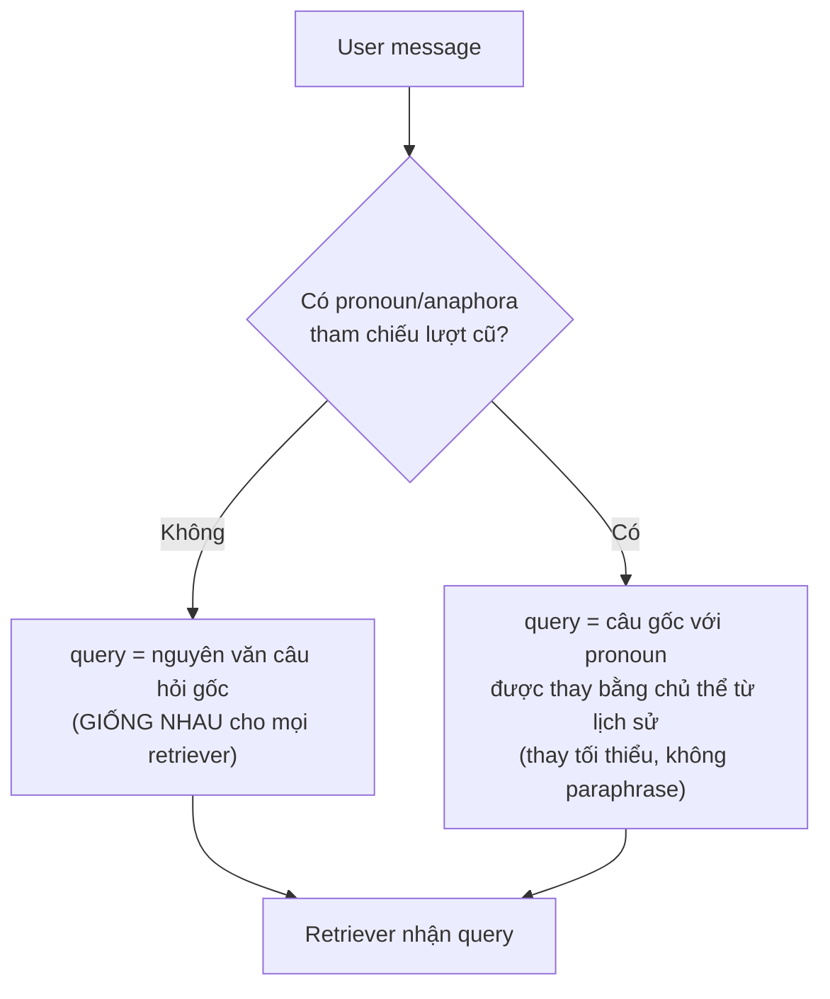

## Bối cảnh

Hiện tại `tool_picker_prompt` trong [application/router.py](application/router.py) (Rule 4) yêu cầu Router viết `query` thành "câu hỏi ĐỘC LẬP, đầy đủ chủ thể, đối tượng, tình tiết và thời gian". LLM hiểu đây là chỉ thị **paraphrase/tóm tắt từng vế** → mất tình tiết quan trọng khi user nhập kịch bản dài (như case "anh Thắng – chị Huyền").

Code path duy nhất sinh `query` cho retriever:

```360:405:application/router.py
def _resolved_query(tool_call, fallback_question):
    args = tool_call.get("args") or {}
    query = str(args.get("query") or "").strip()
    return query or fallback_question

def _tool_function_args(tools, tool_call, fallback_question):
    ...
    resolved_query = _resolved_query(tool_call, fallback_question)
    if _tool_accepts_query(tools, tool_name):
        function_args["query"] = resolved_query
    return function_args, resolved_query
```

→ Toàn bộ vấn đề nằm ở `args.query` do Router LLM trả về, được điều khiển bởi `tool_picker_prompt`.

## Chính sách mới (verbatim-unless-followup)



Pronoun/anaphora cần resolve: `anh ấy`, `cô ấy`, `họ`, `nó`, `cái đó`, `trường hợp đó`, `vậy`, `như vậy`, `vậy thì`, `thế thì`, ellipsis kiểu `Còn X thì sao?`.

## Thay đổi chính

### 1) Viết lại Rule 4 trong `tool_picker_prompt`

File [application/router.py](application/router.py), trong chuỗi `tool_picker_prompt` (dòng ~36–78).

Thay Rule 4 hiện tại:

```
4. GIẢI THAM CHIẾU FOLLOW-UP: Với MỖI tool, tham số `query` phải là một câu hỏi ĐỘC LẬP, đầy đủ chủ thể, đối tượng, tình tiết và thời gian lấy từ lịch sử. Không để đại từ mơ hồ như "nó", "cái đó", "trường hợp trên" trong `query`.
```

Bằng quy tắc mới (đại ý):

- **MẶC ĐỊNH PHẢI GIỮ NGUYÊN VĂN**: tham số `query` cho MỌI tool được chọn PHẢI là **toàn bộ câu hỏi gốc của user trong lượt hiện tại**, copy nguyên văn, không paraphrase, không tóm tắt, không bỏ chi tiết, không tách thành sub-question.
- **CHỈ SỬA KHI FOLLOW-UP CÓ PRONOUN/ANAPHORA**: nếu câu hỏi hiện tại chứa đại từ tham chiếu (`anh ấy`, `cô ấy`, `họ`, `nó`, `cái đó`, `trường hợp đó`, `vậy`, `như vậy`, `vậy thì`, `thế thì`) HOẶC ellipsis kiểu "Còn X thì sao?", chỉ được thay đại từ/ellipsis đó bằng cụm danh từ tương ứng từ lịch sử gần. Giữ nguyên phần còn lại của câu.
- **CẤM HÀNH VI**: cấm tóm tắt nhiều vế thành 1 vế, cấm chia 1 câu thành nhiều query khác nhau, cấm thêm tình tiết LLM tự suy ra, cấm bỏ kịch bản tình huống mà user mô tả.
- **NHIỀU RETRIEVER → CÙNG 1 `query`**: khi gọi nhiều retriever cho cùng một lượt, tất cả nhận `query` GIỐNG HỆT NHAU (chính là câu gốc / câu đã resolve pronoun). Phân biệt giữa các retriever bằng `name`, KHÔNG bằng cách viết query khác nhau. Retriever bên trong có classifier riêng tự lọc template theo nội dung.

### 2) Thay/bổ sung ví dụ trong prompt

Trong cùng `tool_picker_prompt`:

- Xoá hoặc viết lại các Ví dụ 1–4 hiện tại để KHÔNG còn ngụ ý "viết query riêng theo từng ý". Giữ phần "tool nào được chọn" nhưng nói rõ `query` là nguyên văn câu hỏi gốc.
- Thêm 2 ví dụ mới:

  **Ví dụ A — câu dài, không follow-up (case của user)**
  - Câu gốc: "Sau khi kết hôn, anh Thắng yêu cầu vợ là chị Huyền ở nhà nội trợ … Hỏi: ý kiến mẹ chồng tài sản là của anh Thắng đúng/sai? Tài sản vợ chồng anh Thắng và chị Huyền được pháp luật quy định thế nào?"
  - Tool: `che_do_tai_san_cua_vo_chong`, `quyen_nghia_vu_vo_chong`.
  - `query` cho cả hai = nguyên văn toàn bộ đoạn trên. KHÔNG tách, KHÔNG tóm tắt.

  **Ví dụ B — follow-up có pronoun**
  - Lượt trước: "Nam 18 tuổi có được kết hôn không?"
  - Lượt hiện tại: "Còn nữ thì sao?"
  - Tool: `dieu_kien_ket_hon`.
  - `query` = "Nữ 18 tuổi có được kết hôn không?" (chỉ thay ellipsis "Còn nữ thì sao?" bằng cụm tương đương, giữ cấu trúc gốc).

### 3) Cập nhật mô tả parameter `query` ở 1 chỗ tập trung

Trong `_router_tool_descriptions` ([application/router.py](application/router.py) dòng 295–349), thêm bước override `properties["query"]["description"]` cho các retriever không phải direct tool. Mục đích: làm tín hiệu thứ 2 ngoài prompt, giảm rủi ro LLM bỏ qua.

Mô tả mới đại ý:

> "Câu hỏi của người dùng. MẶC ĐỊNH copy NGUYÊN VĂN toàn bộ câu hỏi user vừa nhập trong lượt hiện tại. Chỉ được thay đại từ tham chiếu (anh ấy, cô ấy, họ, nó, cái đó, trường hợp đó, vậy, như vậy) bằng chủ thể tương ứng từ lịch sử khi câu hỏi là follow-up. KHÔNG paraphrase, KHÔNG tóm tắt, KHÔNG tách thành sub-question, KHÔNG bỏ chi tiết tình huống."

Override chỉ áp cho retriever (không động vào `clarify.question` / `respond.answer` / `text2cypher.query`).

### 4) (Safety net, tuỳ chọn) Fallback verbatim khi LLM vẫn paraphrase

Trong `_tool_function_args` ([application/router.py](application/router.py) dòng 377–405): sau khi tính `resolved_query`, nếu phát hiện:

- `fallback_question` (câu gốc) KHÔNG chứa pronoun/anaphora trong danh sách (regex tiếng Việt: `\b(anh ấy|cô ấy|họ|nó|cái đó|trường hợp đó|vậy|như vậy|vậy thì|thế thì|còn .* thì sao)\b`), VÀ
- `resolved_query` ngắn hơn `fallback_question` quá ngưỡng (ví dụ < 60% độ dài hoặc < 70% tokens),

→ ép `resolved_query = fallback_question`. Log warning có metadata để debug.

Lưu ý: chỉ nên bật như safety net; ưu tiên fix bằng prompt (Bước 1+2+3) trước. Nếu user không muốn thêm logic deterministic, có thể bỏ Bước 4.

### 5) Cập nhật test

[tests/test_router_conversation.py](tests/test_router_conversation.py):

- Giữ test `test_function_args_keep_resolved_query_and_strip_controls` (vẫn hợp lệ vì Router LLM có thể trả query đã resolve cho follow-up; nội dung test không trái chính sách mới).
- Thêm test mới cho safety net (nếu làm Bước 4): paraphrase quá ngắn + không có pronoun → fallback về `fallback_question`.
- Thêm test mới cho safety net: có pronoun → giữ nguyên `resolved_query` từ Router (không fallback).

### 6) Cập nhật tài liệu

- [thesis-context/chat-flow.md](thesis-context/chat-flow.md) §"Router cache reuse" và §"Conversation memory": ghi rõ chính sách verbatim mới và nói rõ `resolved_query` trong `retrieval_memory` lưu phiên bản đã resolve pronoun (giống hôm nay), không ảnh hưởng cache.
- [docs/conversation_context.md](docs/conversation_context.md): nếu có mô tả "Router viết lại câu độc lập", chỉnh thành "Router giữ nguyên văn, chỉ resolve pronoun cho follow-up".

### Không cần đụng

- `presentation/main.py`: vẫn truyền `updated_question = input_text` (không thay đổi).
- Retriever individual schemas (mỗi file `adapter/retrievers/**/*.py`): không cần sửa từng file vì description được override tập trung tại Bước 3.
- `application/query_updater.py`: vẫn không nằm trên flow chính, không sửa.
- `retrieval_memory` schema và validate_reuse_request: không đổi (cache vẫn hoạt động bình thường).

## Kế hoạch verify

- Re-test case "anh Thắng – chị Huyền": kỳ vọng `che_do_tai_san_cua_vo_chong` và `quyen_nghia_vu_vo_chong` đều nhận query nguyên văn toàn đoạn.
- Re-test "Nam 18 tuổi có được kết hôn không?" → "Còn nữ thì sao?": kỳ vọng query gửi vào `dieu_kien_ket_hon` là "Nữ 18 tuổi có được kết hôn không?".
- Test câu nhiều ý sạch: "Tôi nam 18 tuổi có được kết hôn không? Và tôi có quyền yêu cầu huỷ kết hôn trái pháp luật của bố mẹ tôi không?" → cả 2 retriever nhận query nguyên văn cả câu.
