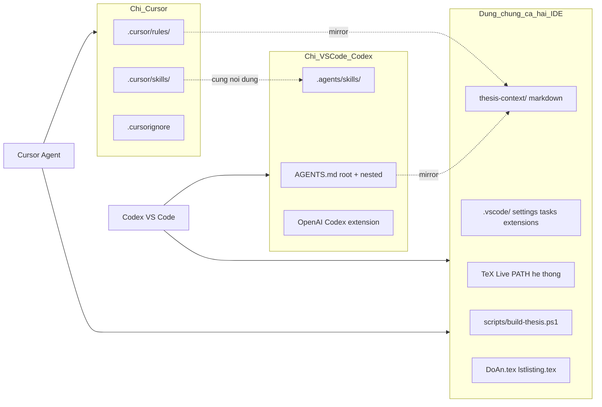
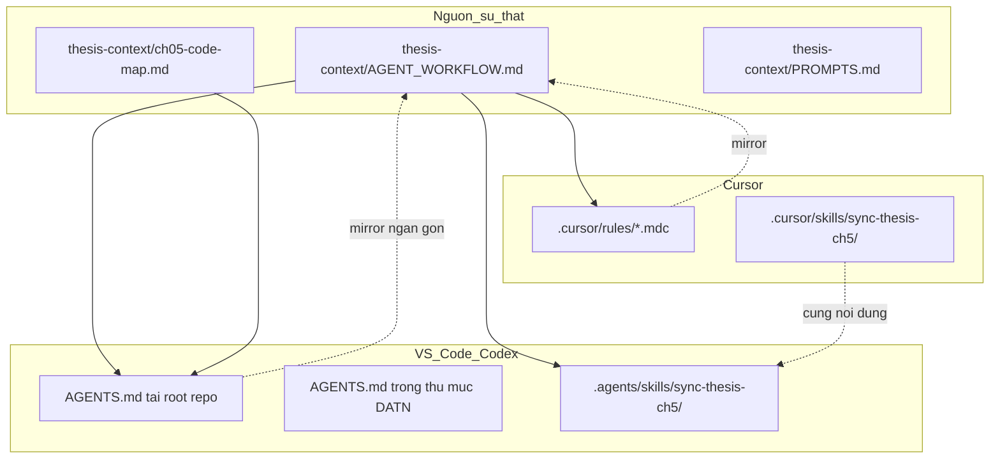

# Kế hoạch setup LaTeX + Agent viết đồ án khớp codebase

## Bối cảnh hiện tại

Bạn đã có lợi thế lớn: **codebase và LaTeX nằm chung một repo** tại [`G:/Agentic GraphRAG Chatbot luật`](G:/Agentic GraphRAG Chatbot luật).

| Thành phần | Vị trí | Ghi chú |
|---|---|---|
| Mã nguồn chatbot | `presentation/`, `application/`, `adapter/`, `utils/` | Đã có [`README.md`](README.md) và [`integration.md`](integration.md) mô tả kiến trúc |
| LaTeX đồ án | [`ĐATN_20225919_Lê_Thái_Sơn_Chatbot_tư_vấn_luật_hôn_nhân_gia_đình/`](ĐATN_20225919_Lê_Thái_Sơn_Chatbot_tư_vấn_luật_hôn_nhân_gia_đình/) | Root file: [`DoAn.tex`](ĐATN_20225919_Lê_Thái_Sơn_Chatbot_tư_vấn_luật_hôn_nhân_gia_đình/DoAn.tex), chương ưu tiên: [`Chuong/5_Giai_phap_dong_gop.tex`](ĐATN_20225919_Lê_Thái_Sơn_Chatbot_tư_vấn_luật_hôn_nhân_gia_đình/Chuong/5_Giai_phap_dong_gop.tex) |
| Cursor rules/skills | **Chưa có** | Cần tạo mới |
| LaTeX IDE config | **Chưa có** (`.vscode/` bị gitignore) | Cần tạo `.vscode/` + commit git để Cursor và VS Code dùng chung |

**Vấn đề cần xử lý sớm:** [`DoAn.tex`](ĐATN_20225919_Lê_Thái_Sơn_Chatbot_tư_vấn_luật_hôn_nhân_gia_đình/DoAn.tex) dòng 63 tham chiếu `\include{lstlisting}` nhưng file `lstlisting.tex` **chưa tồn tại** — compile sẽ lỗi cho đến khi tạo file này.

---

## Nguyên tắc parity Cursor ↔ VS Code (+ Codex)

Bạn sẽ luân phiên hai IDE — **Cursor Agent** cho một số session, **Codex** (extension VS Code) cho session khác. Mọi cấu hình phải tuân theo quy tắc **một nguồn sự thật trong repo**:



| Thành phần | Cursor | VS Code + Codex | Cách đảm bảo cùng kết quả |
|---|---|---|---|
| Compile LaTeX | LaTeX Workshop đọc `.vscode/settings.json` | Giống hệt | Cấu hình **chỉ** trong `.vscode/`; commit vào git |
| Build từ terminal | `scripts/build-thesis.ps1` | Giống hệt | Script độc lập IDE |
| PDF output | `ĐATN_.../build/DoAn.pdf` | Giống hệt | Cùng `outDir` + script |
| Extension LaTeX | LaTeX Workshop | LaTeX Workshop | `.vscode/extensions.json` |
| **Agent viết đồ án** | Cursor Agent + `.cursor/rules/` + `.cursor/skills/` | **Codex** + `AGENTS.md` + `.agents/skills/` | Nội dung gốc trong `thesis-context/AGENT_WORKFLOW.md`; Cursor/Codex chỉ mirror |
| Prompt mẫu | `@file` trong Agent chat | Codex chat + file context tự nhiên | `thesis-context/PROMPTS.md` có mục riêng Cursor vs Codex |
| Loại trừ indexing | `.cursorignore` | `files.exclude` trong settings | Cùng pattern |
| User settings | Không override | Không override | Chỉ workspace settings |

**Quy tắc bắt buộc khi làm việc:**
1. Luôn mở **cùng thư mục gốc repo** — không mở riêng subfolder `ĐATN_...`.
2. Không lưu cấu hình LaTeX ở User Settings; mọi thứ nằm trong `.vscode/settings.json`.
3. Sau mỗi bước setup: **compile thử trên cả Cursor và VS Code**.
4. **Cập nhật `thesis-context/AGENT_WORKFLOW.md` trước**, rồi sync sang `.cursor/rules/`, `.cursor/skills/` và `.agents/skills/` — tránh ba bản lệch nhau.
5. Trên VS Code, **Codex là agent chính** (không Copilot Chat); cài extension **OpenAI Codex** và đăng nhập ChatGPT account có quyền Codex.

---

## Phần 1 — Cài TeX Live và compile LaTeX (dùng chung cả hai IDE)

### 1.1 Cài TeX Live trên Windows (IDE-agnostic)

1. Tải **TeX Live** (installer `.exe`) từ [tug.org/texlive](https://tug.org/texlive/) — chọn full scheme hoặc scheme-medium (đủ cho `vietnam`, `biblatex`, `algorithm2e`, `glossaries`, `subfiles`).
2. Trong installer, bật **"Add to PATH"** (hoặc sau khi cài, thêm `C:\texlive\2024\bin\windows` vào **PATH hệ thống** — cả Cursor và VS Code đều kế thừa PATH này).
3. Mở terminal mới (PowerShell), kiểm tra:

```powershell
pdflatex --version
bibtex --version
```

4. Cài thêm gói nếu thiếu:

```powershell
tlmgr install collection-langvietnamese
```

### 1.2 Cấu hình workspace dùng chung (`.vscode/`)

**Bước bắt buộc:** Sửa [`.gitignore`](.gitignore) — **xóa dòng `.vscode/`** để commit cấu hình workspace; cả Cursor và VS Code đều đọc thư mục này.

Cài extension **LaTeX Workshop** (`James-Yu.latex-workshop`) trên **cả hai IDE**. Mở repo → VS Code/Cursor gợi ý "Install Recommended Extensions" từ [`.vscode/extensions.json`](.vscode/extensions.json):

```json
{
  "recommendations": [
    "James-Yu.latex-workshop",
    "openai.chatgpt"
  ]
}
```

Extension `openai.chatgpt` là **OpenAI Codex extension** chính thức cho VS Code. Cài trên VS Code (Cursor không cần nếu bạn chỉ dùng Cursor Agent ở đó). Đăng nhập ChatGPT account có quyền Codex.

Tạo [`.vscode/settings.json`](.vscode/settings.json) tại **root repo**:

```json
{
  "latex-workshop.latex.rootFile.useSubFile": true,
  "latex-workshop.latex.rootFile.doNotPrompt": true,
  "latex-workshop.latex.rootFile": "ĐATN_20225919_Lê_Thái_Sơn_Chatbot_tư_vấn_luật_hôn_nhân_gia_đình/DoAn.tex",
  "latex-workshop.latex.outDir": "%DIR%/build",
  "latex-workshop.latex.autoBuild.run": "onSave",
  "latex-workshop.latex.recipe.default": "pdflatex -> bibtex -> pdflatex x2",
  "latex-workshop.latex.recipes": [
    {
      "name": "pdflatex -> bibtex -> pdflatex x2",
      "tools": ["pdflatex", "bibtex", "pdflatex", "pdflatex"]
    }
  ],
  "latex-workshop.latex.tools": [
    { "name": "pdflatex", "command": "pdflatex", "args": ["-synctex=1", "-interaction=nonstopmode", "-file-line-error", "%DOC%"] },
    { "name": "bibtex", "command": "bibtex", "args": ["%DOCFILE%"] }
  ],
  "latex-workshop.view.pdf.viewer": "tab",
  "files.exclude": {
    "**/data/viz_snapshots": true,
    "**/frontend/node_modules": true,
    "**/public/chainlit-build": true,
    "ĐATN_20225919_Lê_Thái_Sơn_Chatbot_tư_vấn_luật_hôn_nhân_gia_đình/build": true
  },
  "files.watcherExclude": {
    "**/data/**": true,
    "**/extraction/**": true,
    "**/frontend/node_modules/**": true
  }
}
```

Tạo [`.vscode/tasks.json`](.vscode/tasks.json) — build từ Command Palette (`Tasks: Run Task`) hoạt động **giống nhau** trên cả hai IDE:

```json
{
  "version": "2.0.0",
  "tasks": [
    {
      "label": "Build thesis (DoAn.tex)",
      "type": "shell",
      "command": "powershell",
      "args": ["-File", "${workspaceFolder}/scripts/build-thesis.ps1"],
      "group": { "kind": "build", "isDefault": true },
      "problemMatcher": []
    }
  ]
}
```

Tạo [`scripts/build-thesis.ps1`](scripts/build-thesis.ps1) — fallback IDE-agnostic, dùng để verify khi nghi ngờ extension khác nhau:

```powershell
$ThesisDir = Join-Path $PSScriptRoot ".." "ĐATN_20225919_Lê_Thái_Sơn_Chatbot_tư_vấn_luật_hôn_nhân_gia_đình"
$BuildDir = Join-Path $ThesisDir "build"
New-Item -ItemType Directory -Force -Path $BuildDir | Out-Null
Push-Location $ThesisDir
pdflatex -synctex=1 -interaction=nonstopmode -file-line-error -output-directory=build DoAn.tex
bibtex build/DoAn
pdflatex -synctex=1 -interaction=nonstopmode -file-line-error -output-directory=build DoAn.tex
pdflatex -synctex=1 -interaction=nonstopmode -file-line-error -output-directory=build DoAn.tex
Pop-Location
Write-Host "PDF: $BuildDir/DoAn.pdf"
```

**Workflow compile (giống nhau trên Cursor và VS Code):**
- Mở file `.tex` → Save → LaTeX Workshop auto-build (`onSave`).
- Hoặc `Ctrl+Shift+B` (default build task) / `Ctrl+Alt+B` (LaTeX Workshop recipe).
- Hoặc chạy `scripts/build-thesis.ps1` từ terminal tích hợp.
- PDF: `ĐATN_.../build/DoAn.pdf`; SyncTeX hoạt động trên cả hai IDE.

**Compile từng chương:** File `Chuong/*.tex` dùng `subfiles` — mở trực tiếp `5_Giai_phap_dong_gop.tex` để preview nhanh; cả hai IDE đều respect `rootFile.useSubFile`.

### 1.3 Verify parity sau setup LaTeX

Checklist bắt buộc chạy **một lần**, luân phiên hai IDE:

- [ ] Cursor: Save `DoAn.tex` → PDF sinh ra `build/DoAn.pdf`, không lỗi font tiếng Việt.
- [ ] VS Code: Lặp lại bước trên → **cùng path PDF**, cùng số trang.
- [ ] Terminal (IDE-agnostic): `powershell scripts/build-thesis.ps1` → PDF giống hai bước trên.
- [ ] SyncTeX: click PDF ↔ jump source hoạt động trên cả hai.

### 1.4 Sửa lỗi thiếu `lstlisting.tex`

Tạo [`ĐATN_.../lstlisting.tex`](ĐATN_20225919_Lê_Thái_Sơn_Chatbot_tư_vấn_luật_hôn_nhân_gia_đình/lstlisting.tex) với cấu hình `listings` cho Python/Cypher (font, line break, caption tiếng Việt). Agent sẽ trích code từ repo và chèn bằng `\lstinputlisting` thay vì copy-paste thủ công.

---

## Phần 2 — Kiến trúc ngữ cảnh cho Agent (tiết kiệm token, dùng chung)

Nguyên tắc cốt lõi: **Agent không đọc cả repo**. Nội dung hướng dẫn agent nằm trong **`thesis-context/`**; Cursor và Codex chỉ **mirror** qua cơ chế riêng của từng IDE.



### 2.1 Loại trừ indexing — cùng pattern trên cả hai IDE

**`.cursorignore`** (chỉ Cursor đọc) — tạo tại root repo:

```
data/
extraction/
benchmark_dataset/_state/
benchmark_dataset/benchmark/
frontend/node_modules/
public/chainlit-build/
**/*.docx
**/*.pdf
data/viz_snapshots/
ĐATN_*/build/
ĐATN_*/Obsolete/
```

**`files.exclude` / `files.watcherExclude`** — đã nhúng trong [`.vscode/settings.json`](.vscode/settings.json) (Phần 1.2); VS Code và Cursor đều áp dụng workspace settings này → kết quả duyệt file tương đương.

Giữ lại trong indexing: `adapter/`, `application/`, `presentation/`, `utils/`, `thesis-context/`, file `.tex`, `Hinhve/`.

### 2.2 Thư mục `thesis-context/` — nguồn ngữ cảnh chính (IDE-agnostic)

Tạo tại root repo (không dùng `docs/` vì đang bị [`.gitignore`](.gitignore) loại trừ):

| File | Mục đích | Cursor | Codex (VS Code) |
|---|---|---|---|
| **`AGENT_WORKFLOW.md`** | Quy trình 5 bước, quy tắc LaTeX, cấm bịa — **bản đầy đủ** | `@` hoặc rules mirror | Đọc qua `AGENTS.md` trỏ tới file này |
| `INDEX.md` | Mục lục, changelog đồng bộ | `@` | `@` hoặc tham chiếu trong prompt |
| **`ch05-code-map.md`** | Bản đồ Chương 5 → file code | `@` — ưu tiên | Luôn nhắc trong prompt Codex |
| `PROMPTS.md` | Prompt mẫu | Mục **Cursor Agent** | Mục **Codex** |
| Các file index khác | architecture, retriever, kg-schema... | `@` khi cần | `@` khi cần |

**Ví dụ `ch05-code-map.md`:**

```markdown
## 5.2 Legal reasoning / hiệu lực văn bản
- Thuật toán mô tả: Chuong/5_Giai_phap_dong_gop.tex §5.2.2
- Code thực tế: adapter/cypher_templates/_common.py, utils/general.py
- Kiểm chứng: scripts/test_tham_chieu_ancestor.py
```

### 2.3 Codex trên VS Code — `AGENTS.md` + skills

Codex đọc **`AGENTS.md`** theo thứ tự từ root repo xuống thư mục làm việc hiện tại ([tài liệu Codex](https://developers.openai.com/codex/guides/agents-md)). Giữ mỗi file **ngắn gọn** (giới hạn mặc định ~32 KiB tổng hợp) — chi tiết để trong `thesis-context/`, `AGENTS.md` chỉ trỏ tới.

**a) [`AGENTS.md`](AGENTS.md) tại root repo** (~30–50 dòng):

```markdown
# Agentic GraphRAG Chatbot Luật

## Trước khi sửa nội dung kỹ thuật trong đồ án
1. Đọc thesis-context/AGENT_WORKFLOW.md (quy trình đầy đủ).
2. Đọc thesis-context/ch05-code-map.md (map section → file code).
3. Chỉ mở file code được map; không quét data/, extraction/, obsolete_retrievers/.

## Ưu tiên
- Code thực tế > mô tả cũ trong .tex nếu lệch nhau.
- Chỉ sửa .tex khi được yêu cầu viết đồ án; không refactor codebase trừ khi được yêu cầu.

## LaTeX
- Root: ĐATN_.../DoAn.tex; build output: ĐATN_.../build/
- Chèn code bằng \lstinputlisting; giữ format UET/ĐATN.
```

**b) [`ĐATN_.../AGENTS.md`](ĐATN_20225919_Lê_Thái_Sơn_Chatbot_tư_vấn_luật_hôn_nhân_gia_đình/AGENTS.md)** — override khi làm việc trong thư mục đồ án:

```markdown
# Huong dan rieng cho LaTeX DATN

- Dung subfiles; khong doi preamble DoAn.tex.
- Uu tien chuong: Chuong/5_Giai_phap_dong_gop.tex.
- Sau sua lon: chay scripts/build-thesis.ps1 hoac LaTeX Workshop build.
```

**c) [`.agents/skills/sync-thesis-ch5/SKILL.md`](.agents/skills/sync-thesis-ch5/SKILL.md)** — skill Codex (cùng nội dung với `.cursor/skills/sync-thesis-ch5/SKILL.md`):

Codex tự phát hiện skills trong `.agents/skills/` của repo. Khi prompt có từ khóa "đồng bộ chương 5" / "sync thesis ch5", Codex áp dụng skill này.

**d) Khởi tạo nhanh:** Trong Codex chat, chạy `/init` lần đầu để Codex gợi ý skeleton — **thay nội dung bằng template trên**, không để Codex tự viết đè quy trình đã có.

**e) Windows — trust repo (nếu cần `.codex/config.toml`):** Nếu sau này thêm config Codex repo-local, đảm bảo project được trust trong `~/.codex/config.toml`. Trên Windows, path có thể phân biệt hoa/thường — thêm cả `G:\...` và `g:\...` nếu config không được áp dụng.

### 2.4 Cursor Rules — mirror từ `thesis-context/` (chỉ Cursor)

Tạo `.cursor/rules/*.mdc` với nội dung **rút gọn + trỏ về** `thesis-context/AGENT_WORKFLOW.md` — không đặt logic riêng chỉ có trong rules (tránh lệch VS Code):

**a) `thesis-latex.mdc`** — `globs: ĐATN_**/*.tex`
- Tham chiếu `thesis-context/AGENT_WORKFLOW.md` §Quy tắc LaTeX.

**b) `thesis-code-sync.mdc`** — `alwaysApply: true`
- Tham chiếu `thesis-context/AGENT_WORKFLOW.md` §Quy trình đồng bộ code.

### 2.5 Cursor Skill — mirror workflow Chương 5

Tạo [`.cursor/skills/sync-thesis-ch5/SKILL.md`](.cursor/skills/sync-thesis-ch5/SKILL.md) — **cùng nội dung** với `.agents/skills/sync-thesis-ch5/SKILL.md`. Khi cập nhật workflow: sửa `thesis-context/AGENT_WORKFLOW.md` → sync cả hai skill folders.

---

## Phần 3 — Quy trình làm việc với Agent (Chương 5) — Cursor Agent và Codex

### 3.1 Chuẩn bị một lần

1. Hoàn thành Phần 1 + 2 (gồm `AGENTS.md`, `.agents/skills/`).
2. Tạo `ch05-code-map.md` từ section/label trong [`5_Giai_phap_dong_gop.tex`](ĐATN_20225919_Lê_Thái_Sơn_Chatbot_tư_vấn_luật_hôn_nhân_gia_đình/Chuong/5_Giai_phap_dong_gop.tex) + `adapter/cypher_templates/` + `retriever_catalog.py`.
3. **Verify parity LaTeX** trên Cursor, VS Code, và `scripts/build-thesis.ps1`.
4. **Verify Codex đọc instructions:** Mở VS Code → Codex panel → hỏi "Liệt kê quy tắc từ AGENTS.md và ch05-code-map" → xác nhận Codex nắm workflow.

### 3.2 Prompt mẫu — Cursor Agent vs Codex

Lưu bản đầy đủ trong `thesis-context/PROMPTS.md` (2 mục riêng).

**Cursor Agent:**
```
@thesis-context/AGENT_WORKFLOW.md @thesis-context/ch05-code-map.md @Chuong/5_Giai_phap_dong_gop.tex
Đồng bộ mục §5.2.2 với code thực tế. Chỉ sửa .tex; dùng lstinputlisting.
```

**Codex (VS Code) — session viết/sửa đồ án:**
```
Đọc thesis-context/AGENT_WORKFLOW.md và thesis-context/ch05-code-map.md trước khi làm việc.

Nhiệm vụ: Đồng bộ subsection "Cơ chế kiểm tra hiệu lực" (label table:algo_temporal)
trong Chuong/5_Giai_phap_dong_gop.tex với adapter/cypher_templates/_common.py và utils/general.py.

Ràng buộc:
- Chỉ sửa file .tex
- Dùng \lstinputlisting cho code mẫu (≤30 dòng)
- Không bịa tên relationship Neo4j
- Output: checklist khớp/không khớp từng bước thuật toán
```

Codex tự load `AGENTS.md` khi bắt đầu session — prompt trên **bổ sung** task cụ thể, không cần lặp lại toàn bộ quy tắc.

**Codex — kiểm tra không sửa file:**
```
So sánh algorithm env (label table:algo_temporal) với implementation trong utils/general.py.
Chỉ liệt kê: khớp / lệch / thiếu. Không sửa file.
```

**Prompt kiểm tra — dùng chung logic, copy vào IDE tương ứng.**

### 3.3 Thứ tự ưu tiên đồng bộ Chương 5

Dựa trên nội dung hiện tại [`5_Giai_phap_dong_gop.tex`](ĐATN_20225919_Lê_Thái_Sơn_Chatbot_tư_vấn_luật_hôn_nhân_gia_đình/Chuong/5_Giai_phap_dong_gop.tex):

1. **§5.2 — Legal reasoning + KG schema** → `adapter/cypher_templates/_common.py`, logic hiệu lực, node/relationship thực tế.
2. **Cypher Templates theo domain** → từng thư mục trong `adapter/cypher_templates/<domain>/`.
3. **Agentic Router** (nếu có trong chương 5) → [`application/router.py`](application/router.py), [`application/retriever_catalog.py`](application/retriever_catalog.py).
4. **Chuẩn hóa context cho LLM** → module post-processing trong `utils/`.
5. **Benchmark / đánh giá** (nếu chương 5 đề cập) → `benchmark_dataset/scripts/`.

Mỗi mục = **1 session agent riêng** (tránh context tràn).

### 3.4 Checklist xác minh sau mỗi lần agent sửa

- [ ] Tên quan hệ Neo4j trong `.tex` khớp code (`THAY_THE_BOI`, `DUOC_SUA_DOI_BOI`, ...).
- [ ] Thuật toán (algorithm env) khớp thứ tự bước trong code.
- [ ] `\lstinputlisting` trỏ đúng path, compile không lỗi.
- [ ] Không mô tả component obsolete (`adapter/obsolete_retrievers/`).
- [ ] `\cite{}` và `\ref{}` vẫn resolve sau build.
- [ ] **Compile pass trên cả Cursor và VS Code** (hoặc `scripts/build-thesis.ps1`) sau mỗi batch sửa lớn.

---

## Phần 4 — Cấu trúc thư mục đề xuất (sau setup)

```text
Agentic GraphRAG Chatbot luật/
├── AGENTS.md                         # Codex — root instructions (ngan)
├── .agents/skills/sync-thesis-ch5/   # Codex skills
├── .cursor/                          # Chi Cursor
│   ├── rules/
│   └── skills/sync-thesis-ch5/       # Cung noi dung voi .agents/skills/
├── .cursorignore
├── .vscode/                          # DUNG CHUNG
│   ├── settings.json
│   ├── extensions.json               # LaTeX Workshop + Codex
│   └── tasks.json
├── scripts/build-thesis.ps1
├── thesis-context/                   # NGUON SU THAT
│   ├── AGENT_WORKFLOW.md
│   ├── PROMPTS.md                    # Muc Cursor + muc Codex
│   ├── ch05-code-map.md
│   └── ...
└── ĐATN_.../
    ├── AGENTS.md                     # Codex — override LaTeX
    ├── DoAn.tex
    └── Chuong/5_Giai_phap_dong_gop.tex
```

---

## Phần 5 — Lưu ý và rủi ro

| Rủi ro | Cách giảm |
|---|---|
| Cursor và VS Code compile khác nhau | Workspace `.vscode/settings.json`; verify §1.3; `build-thesis.ps1` |
| Cursor Agent vs Codex hành vi khác nhau | Cùng nội dung gốc `AGENT_WORKFLOW.md`; sync `.cursor/skills/` ↔ `.agents/skills/` |
| Codex không đọc hết instructions | Giữ `AGENTS.md` ngắn, trỏ tới `thesis-context/`; nhắc lại task trong prompt |
| Codex bịa tên module/relationship | `ch05-code-map.md` + checklist verify |
| Ba bản skill/rules lệch nhau | Sửa `AGENT_WORKFLOW.md` trước → sync cả 3 lớp mirror |
| Token tăng cao | Index markdown + prompt theo subsection |
| VS Code thiếu Cursor rules | `AGENTS.md` + `.agents/skills/` thay thế tương đương |
| `.vscode/` bị gitignore | Xóa dòng `.vscode/` khỏi gitignore |
| Codex Windows trust path | Trust project trong `~/.codex/config.toml` (chú ý hoa/thường drive letter) |

---

## Thứ tự thực hiện đề xuất

1. Cài TeX Live + sửa `.gitignore` + tạo `.vscode/` (LaTeX Workshop + Codex) + `scripts/build-thesis.ps1` + `lstlisting.tex`.
2. **Verify parity LaTeX** trên Cursor, VS Code, và script (§1.3).
3. Tạo `thesis-context/` (`AGENT_WORKFLOW.md`, `ch05-code-map.md`, `PROMPTS.md` với mục Cursor + Codex).
4. Tạo **`AGENTS.md`** (root + nested ĐATN) + **`.agents/skills/sync-thesis-ch5/`**; verify Codex đọc instructions.
5. Tạo **`.cursor/rules/`** + **`.cursor/skills/`** (mirror cùng nội dung).
6. Đồng bộ Chương 5 từng subsection — luân phiên Cursor Agent / Codex tùy IDE đang mở; compile trên **cả hai IDE** sau mỗi batch.
7. Mở rộng map cho Chương 4 / Phụ lục khi Chương 5 ổn định.

---

## Phần 6 — Phân quyền: Agent tự làm vs cần bạn (đã kiểm tra môi trường)

**Kết luận ngắn:** Agent có thể **tự làm ~80%** (toàn bộ file trong repo). **~20% còn lại bắt buộc bạn thao tác tay** — chủ yếu cài TeX Live và xác nhận compile/extension. **Không cần cấp thêm quyền đặc biệt** cho agent ngoài quyền ghi file workspace (đã có).

### Trạng thái môi trường hiện tại (đã probe)

| Kiểm tra | Kết quả |
|---|---|
| Ghi file vào repo | OK |
| `pdflatex` / `bibtex` / `tlmgr` trong PATH | **Chưa có** |
| TeX tại `C:\texlive\2024` hoặc `2025` | **Chưa cài** |
| VS Code CLI (`code`) | OK |
| Cursor CLI (`cursor`) | OK |
| Extension Codex (`openai.chatgpt`) trong VS Code | **Đã cài** |
| Extension LaTeX Workshop trong VS Code | **Chưa cài** |
| `.vscode/` trong repo | Thư mục tồn tại nhưng **trống**; vẫn bị `.gitignore` |
| `AGENTS.md`, `thesis-context/`, `lstlisting.tex` | **Chưa có** |
| `winget` | Có (v1.28); cài TeX qua winget **có thể** nhưng thường cần UAC/admin |

### Agent làm được hoàn toàn (khi bạn bảo 「execute the plan」)

Không cần bạn can thiệp — chỉ cần quyền ghi workspace (đã có):

- Sửa `.gitignore` (bỏ `.vscode/`, thêm `build/`).
- Tạo `.vscode/settings.json`, `extensions.json`, `tasks.json`.
- Tạo `scripts/build-thesis.ps1`, `lstlisting.tex`.
- Tạo toàn bộ `thesis-context/` (gồm `AGENT_WORKFLOW.md`, `ch05-code-map.md` quét từ codebase, `PROMPTS.md`, …).
- Tạo `AGENTS.md` (root + nested ĐATN), `.agents/skills/`, `.cursor/rules/`, `.cursor/skills/`, `.cursorignore`.
- Chạy lệnh `code --install-extension James-Yu.latex-workshop` (xem mục dưới — có thể cần bạn approve popup).

### Agent có thể thử nhưng thường cần bạn approve

| Thao tác | Lý do cần bạn |
|---|---|
| `winget install` TeX Live | UAC admin, download ~4–7 GB, có thể treo; **khuyến nghị bạn cài tay** bằng installer `.exe` |
| `code --install-extension James-Yu.latex-workshop` | VS Code có thể hỏi xác nhận; Cursor cần cài extension **riêng** (Install Recommended hoặc marketplace) |
| Sửa `~/.codex/config.toml` (trust project) | File ngoài repo; agent có thể sửa nếu bạn cho phép, nhưng nhạy cảm — **nên bạn tự sửa** nếu Codex báo untrusted |

### Bắt buộc bạn làm tay (agent không thay thế được)

| # | Việc | Thời điểm | Ghi chú |
|---|---|---|---|
| **1** | **Cài TeX Live** + thêm vào PATH hệ thống | **Trước** khi verify compile | Tải [tug.org/texlive](https://tug.org/texlive/); tick "Add to PATH"; mở terminal mới; chạy `pdflatex --version` |
| **2** | Cài **LaTeX Workshop** trên Cursor | Sau agent tạo `extensions.json` | VS Code: bấm "Install Recommended"; Cursor: Extensions → tìm `James-Yu.latex-workshop` |
| **3** | Đăng nhập **Codex** trong VS Code | Một lần | Extension đã có; cần ChatGPT account có quyền Codex |
| **4** | **Verify compile** §1.3 (Save PDF, SyncTeX) | Sau cài TeX | Agent chạy được `build-thesis.ps1` **sau khi** bạn cài TeX; bạn mở PDF xác nhận trực quan |
| **5** | Verify Codex đọc `AGENTS.md` | Sau agent tạo file | Hỏi Codex 1 câu test (plan §3.1 bước 4) — **30 giây tay bạn** |
| **6** | Duyệt nội dung học thuật Chương 5 | Khi đồng bộ từng mục | Agent so khớp code; **bạn** chốt wording đồ án |

### Không cần cấp thêm quyền gì cho agent

- **PATH hệ thống:** Agent **không nên** tự sửa PATH Windows (cần admin + rủi ro). Bạn cài TeX Live installer có tick PATH là đủ.
- **Tải file:** Agent có network nhưng cài TeX qua winget/installer nặng và hay fail — **bạn cài TeX tay 1 lần** ổn định hơn.
- **Git commit:** Agent chỉ commit khi bạn yêu cầu (theo rule dự án).

### Thứ tự thực hiện đề xuất (cập nhật — chia Agent / Bạn)

**Bạn (trước hoặc song song):**
1. Cài TeX Live + verify `pdflatex --version` trong terminal mới.
2. (Tuỳ chọn) Cài LaTeX Workshop trên Cursor nếu chưa có.

**Agent (execute plan):**
3. Tạo toàn bộ file repo (`.vscode/`, `thesis-context/`, `AGENTS.md`, rules, skills, script, `lstlisting.tex`, …).
4. Chạy `code --install-extension James-Yu.latex-workshop` nếu VS Code chưa có.
5. Chạy `scripts/build-thesis.ps1` — **chỉ thành công sau bước 1 của bạn**.
6. Bắt đầu đồng bộ Chương 5 từng subsection.

**Bạn (sau agent):**
7. Verify PDF + SyncTeX trên Cursor và VS Code (checklist §1.3).
8. Test Codex đọc instructions; duyệt nội dung `.tex`.
