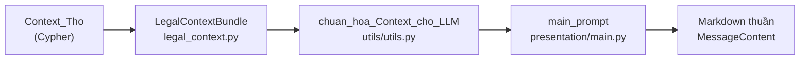
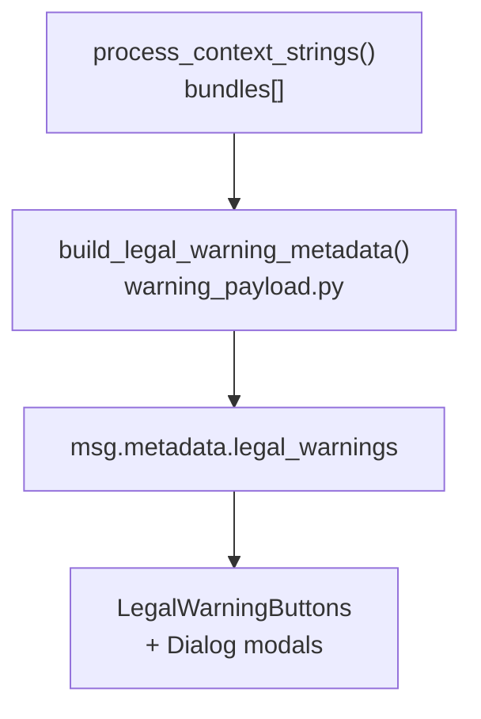

# Kế hoạch: Modal chi tiết cảnh báo hiệu lực & mâu thuẫn

## Hiện trạng (đã đọc code)



- **Cảnh báo hiệu lực** được tính trong [`utils/utils.py`](utils/utils.py) (`chuan_hoa_Context_cho_LLM`): `doc_hieu_luc_map`, `lien_ket_hien_hanh`, `can_cu_sap_hieu_luc`, cờ `FLAG_VAN_BAN_SAP_HIEU_LUC`.
- **Cảnh báo mâu thuẫn** nằm trong `bundle.conflicts` (từ `can_cu_mau_thuan` / `MAU_THUAN_VOI`).
- Chat UI **chưa có** panel/modal cảnh báo; [`compare_actions.py`](presentation/compare_actions.py) dùng Chainlit `Action` → message mới (user **không** muốn pattern này).
- `message.metadata` hiện chỉ có `retrieval_memory_entries`, `turn_anchor` ([`presentation/main.py`](presentation/main.py) ~748–750).
- **Gap quan trọng:** `LegalContextBundle` **chưa lưu** `lien_ket_hien_hanh` (cặp thay thế hiện hành) — chỉ có `replacement_ids` (danh sách phẳng). Cần mở rộng schema để build Bảng 1 đúng logic backend.

## Phạm vi đã xác nhận với bạn

| Cảnh báo | Nút hiện khi | Nội dung modal |
|---|---|---|
| Hiệu lực | Có dòng Bảng 1 **hoặc** Bảng 2 | Bảng 1: hết HL + thay thế; Bảng 2: ban hành chưa HL |
| Mâu thuẫn | `conflicts.length > 0` | Điều khoản xung đột → mô tả → nội dung chi tiết |

- Bảng 1: căn cứ có ngày hết hiệu lực **nhưng chưa có thay thế** → vẫn hiển thị dòng, cột thay thế = `—`.
- Bảng 1 **dedupe theo phân cấp ID** (Điều / Khoản / Điểm) — xem mục 1b-dedupe bên dưới.
- Bảng 2 **dedupe tương tự** trên `impacted_basis_id` và `source_id` — xem mục 1c-dedupe.
- **Không** gom các cờ khác (sửa đổi, nhiều cấp bậc, luật cũ) vào modal hiệu lực.

## Kiến trúc đề xuất



- **Backend:** tính payload JSON tại thời điểm gửi message, gắn vào metadata → persist qua thread reload.
- **Frontend:** đọc `message.metadata.legal_warnings`, render Chip + `Dialog` ([`frontend/src/components/ui/dialog.tsx`](frontend/src/components/ui/dialog.tsx)) — modal thật, đóng bằng X/overlay.

---

## 1. Backend — mở rộng bundle & builder payload

### 1a. Thêm `replacement_relations` vào LegalContextBundle

File: [`application/legal_context.py`](application/legal_context.py)

- Trong `build_legal_context_bundle()`: thêm field optional (backward-compatible schema v1):

```python
"replacement_relations": _unique_dicts(
    context_tho.get("lien_ket_hien_hanh"),
    ("id_hien_hanh", "id_duoc_thay_the"),
)
```

- Merge trong `merge_legal_context_bundles()`.
- Round-trip trong `legal_context_bundle_to_context_tho()` → `lien_ket_hien_hanh`.

### 1b. Module mới `application/warning_payload.py`

**ID → tên chuẩn** (Req 4): hàm `format_provision_label(id: str) -> str`

- Parse ID **giữ đúng cấp hiển thị** (không roll-up về Điều khi build label):
  - `Luat_HNGD_2014_Dieu_35` → `Điều 35 Luật HNGD 2014`
  - `Luat_HNGD_2014_Dieu_35_Khoan_2` → `Khoản 2 Điều 35 Luật HNGD 2014`
  - `..._Khoan_2_Diem_a` → `Điểm a Khoản 2 Điều 35 Luật HNGD 2014`
- Map prefix văn bản (dict tĩnh, mở rộng dần):
  - `Luat_HNGD_2014` → `Luật HNGD 2014`
  - `Luat_HoTich_2014` / `Luat_HoTich_2026` → `Luật Hộ tịch 2014/2026`
  - `NghiDinh_{so}_{nam}_ND_CP` → `Nghị định {so}/{nam}/NĐ-CP`
  - Fallback: humanize token (`HoTich` → `Hộ tịch`, `_` → space).
- Link TVPL vẫn dùng `_to_dieu_id` / `_dieu_level_id` ([`utils/utils.py`](utils/utils.py)) — URL chỉ có ở cấp Điều.

**`build_validity_warning_payload(bundle)`** → `None | dict`

*Bảng 1 — `expired_rows`* (gộp từ 2 nguồn, **giữ `basis_id` đúng cấp node KG**, sau đó dedupe phân cấp):

1. Mọi `provision` trong bundle có `effective_until` → dòng cơ sở với `basis_id = provision.id` (cột thay thế `—`).
2. Mọi `replacement_relations` `{id_hien_hanh, id_duoc_thay_the}` → enrich/join:
   - `basis_id` = `id_duoc_thay_the` **nguyên vẹn** (có thể là Điều, Khoản hoặc Điểm — khớp `chi_tiet_ap_dung` trong Cypher).
   - `replacement_id` = `id_hien_hanh` nguyên vẹn.
   - `basis_*` / `replacement_*` dates lookup từ `provisions` map theo exact ID.
   - `replacement_content_url` từ `citation_links[_to_dieu_id(id_hien_hanh)]`.

### 1b-dedupe. Dedupe phân cấp Điều / Khoản / Điểm (dùng chung Bảng 1 & 2)

Helper generic trong `warning_payload.py`:

```python
def _is_strict_ancestor(ancestor_id: str, node_id: str) -> bool:
    return bool(ancestor_id and node_id and node_id != ancestor_id
                and node_id.startswith(ancestor_id + "_"))

def _dedupe_rows_by_ancestor(rows: list[dict], field: str) -> list[dict]:
    ids = {r[field] for r in rows if r.get(field)}
    return [
        r for r in rows
        if not any(_is_strict_ancestor(a, r[field]) for a in ids)
    ]
```

**Quy tắc (áp dụng cho cả hai bảng):**

| Tình huống | Hàng hiển thị | Hàng ẩn |
|---|---|---|
| Cả **Điều** bị tác động | 1 dòng cấp **Điều** | Mọi **Khoản**, **Điểm** con của Điều đó |
| Chỉ **1 Khoản** bị tác động | 1 dòng cấp **Khoản** | Mọi **Điểm** con của Khoản đó; Khoản/Điểm khác cùng Điều vẫn hiện |
| Chỉ **1 Điểm** bị tác động | 1 dòng cấp **Điểm** | — |

#### Bảng 1 (`expired_rows`)

- Dedupe field: **`basis_id`** (= căn cứ hết hiệu lực / bị thay thế).
- Gọi: `_dedupe_rows_by_ancestor(rows, "basis_id")`.

**Ví dụ Bảng 1:**

- Có `Luat_HNGD_2014_Dieu_35` → loại `..._Dieu_35_Khoan_1`, `..._Khoan_1_Diem_a`.
- Có `..._Dieu_35_Khoan_2` (không có dòng Điều) → loại `..._Khoan_2_Diem_a`; vẫn giữ `..._Khoan_1` nếu Khoản 1 bị tác động riêng.

**Lưu ý Bảng 1:**

- `basis_id` = exact ID từ provision / `id_duoc_thay_the` — **không** `_dieu_level_id`.
- Cùng `basis_id` từ 2 nguồn → merge field (ưu tiên dòng có thông tin thay thế).

#### Bảng 2 (`future_rows`) — dedupe tương tự

Mỗi dòng có 2 ID pháp lý:

| Field payload | Nguồn bundle | Cột UI |
|---|---|---|
| `source_id` | `future_relations[].source_id` / `provision.id` | **Tên căn cứ** (văn bản sắp HL) |
| `impacted_basis_id` | `future_relations[].target_id` / `id_duoc_tac_dong` | **Căn cứ bị tác động** |

**Hai bước dedupe (cùng thứ tự):**

1. `_dedupe_rows_by_ancestor(rows, "impacted_basis_id")` — căn cứ bị tác động: nếu cả Điều bị thay thế/sửa/bãi bỏ thì ẩn Khoản/Điểm con (giống Bảng 1).
2. `_dedupe_rows_by_ancestor(rows, "source_id")` — văn bản mới: nếu đã có dòng `source_id` cấp Điều thì ẩn Khoản/Điểm con của văn bản đó (Cypher có thể sinh thêm `chi_tiet_thay_the_sap` cùng `id_duoc_tac_dong`).

**Ví dụ Bảng 2:**

- `source=Luat_HoTich_2026_Dieu_16`, `impacted=Luat_HoTich_2014_Dieu_18` → ẩn mọi dòng có `impacted` là Khoản/Điểm con của `Dieu_18`.
- Cùng cặp trên + thêm `source=Luat_HoTich_2026_Dieu_16_Khoan_1`, `impacted=Luat_HoTich_2014_Dieu_18` → bước 2 ẩn dòng Khoản (source con của `Dieu_16`).
- Chỉ `source=..._Dieu_16_Khoan_2`, `impacted=..._Dieu_18_Khoan_2` (không có dòng Điều) → giữ Khoản 2, ẩn Điểm con nếu có.

**Lưu ý Bảng 2:**

- `source_id` / `impacted_basis_id` giữ exact ID từ KG — **không** roll-up (Cypher: `id_duoc_tac_dong: chi_tiet_ap_dung.id`).
- Dedupe chạy sau lọc `_LOAI_TAC_DONG_VAN_BAN_MOI` và sau merge multi-bundle.

*Bảng 2 — `future_rows`* (chỉ khi `not bundle.is_user_provided_date`):

- Lọc `future_relations` có `provision` và `relation_type` ∈ `_LOAI_TAC_DONG_VAN_BAN_MOI` ([`utils/utils.py`](utils/utils.py) — loại trừ `HET_HIEU_LUC`, giống `_filter_sap_hieu_luc_noi_dung`).
- Mỗi dòng giữ `source_id`, `impacted_basis_id` ở đúng cấp KG (xem mục 1b-dedupe).
- Cột map 1:1 ảnh mẫu:
  - `basis_name` ← `format_provision_label(source_id)`
  - `issued_date`, `effective_date` từ `provision`
  - `impact_type` ← `_LOAI_TAC_DONG_LABEL[relation_type]`
  - `impacted_basis_name` ← `format_provision_label(impacted_basis_id)`
  - `content_url` ← `citation_links[_to_dieu_id(source_id)]`
- Ngày format `DD-MM-YYYY` qua `_format_date_vn`.
- Sau gộp rows: dedupe 2 bước trên `impacted_basis_id` rồi `source_id`.

**`build_conflict_warning_payload(bundle)`** → `None | dict`

Mỗi conflict `{id_nguon, id_dich, noidung_giai_thich, noidung_dich}`:

```python
{
  "items": [{
    "provisions": [
      {"id", "name"},
      {"id", "name"},
    ],
    "summary": noidung_giai_thich,
    "details": [
      {"id", "name", "content": ...},  # nguồn: lookup provisions[].content
      {"id", "name", "content": noidung_dich},
    ],
  }]
}
```

**`build_legal_warning_metadata(bundles: list)`** — merge nhiều bundle (multi-retriever); sau gộp:
- Bảng 1: `_dedupe_rows_by_ancestor(expired_rows, "basis_id")`
- Bảng 2: `_dedupe_rows_by_ancestor(future_rows, "impacted_basis_id")` → `_dedupe_rows_by_ancestor(..., "source_id")`

### 1c. Gắn vào message

File: [`presentation/main.py`](presentation/main.py)

Sau `context_pipeline = process_context_strings(...)` (~704):

```python
legal_warnings = build_legal_warning_metadata(context_pipeline.bundles)
# ...
routing_metadata["legal_warnings"] = legal_warnings  # nếu có
```

Gắn trước `msg.update()` cho cả nhánh direct answer (~694) và streaming (~748).

Metadata contract:

```typescript
legal_warnings?: {
  validity?: {
    expired_rows: Array<{...}>,
    future_rows: Array<{...}>,
  },
  conflict?: {
    items: Array<{...}>,
  },
}
```

---

## 2. Frontend — Chip + Modal

### 2a. Types

File mới: `frontend/src/types/legalWarnings.ts` — mirror schema backend.

### 2b. Components

| File | Vai trò |
|---|---|
| `frontend/src/components/chat/Messages/Message/LegalWarningButtons.tsx` | Container: đọc `message.metadata.legal_warnings`, render 0–2 Chip |
| `ValidityWarningModal.tsx` | Dialog: tiêu đề + Bảng 1 (nếu có) + Bảng 2 tiêu đề *"Văn bản đã ban hành, chưa có hiệu lực"* |
| `ConflictWarningModal.tsx` | Dialog: lặp từng conflict, `<Separator />` giữa 3 phần |

**Chip** (đặt cuối câu trả lời, trước copy/compare):

- Hiệu lực: icon `Clock` / `AlertTriangle`, label `"Chi tiết cảnh báo hiệu lực"`.
- Mâu thuẫn: icon `GitCompare` / `AlertOctagon`, label `"Chi tiết cảnh báo mâu thuẫn"`.
- Dùng `Button variant="outline" size="sm"` hoặc shadcn `Badge` clickable — 2 nút độc lập.

**Bảng hiệu lực:**

- Dùng `Table` UI (`frontend/src/components/ui/table.tsx` nếu có, hoặc HTML table styled).
- Cột *Nội dung*: chỉ `<a href={url} target="_blank">Xem trên thuvienphapluat.vn</a>` khi có URL; không render full `noidung`.
- Bảng 2 dark-friendly, responsive scroll ngang trên mobile.

**Modal mâu thuẫn:**

1. Bullet/list tên điều khoản (đã map label).
2. `<Separator />`
3. Đoạn `summary`.
4. `<Separator />`
5. Block nội dung từng điều (`whitespace-pre-wrap`, font mono nhẹ cho trích dẫn pháp luật).

### 2c. Wiring

File: [`frontend/src/components/chat/Messages/Message/index.tsx`](frontend/src/components/chat/Messages/Message/index.tsx)

Thêm `<LegalWarningButtons message={message} />` ngay sau `<MessageContent />`, trước `<MessageButtons />` (assistant message branch ~170–184).

**Không** dùng `MessageActions` / `callAction`.

---

## 3. Tests

File mới: `tests/test_warning_payload.py`

- Map ID: `Luat_HNGD_2014_Dieu_35`, `Luat_HoTich_2026_Dieu_16`, Khoản/Điểm, Nghị định.
- Bảng 1: provision hết HL không thay thế → cột thay thế `—`.
- Bảng 1: join `replacement_relations`.
- **Bảng 1 dedupe:** `basis_id` — Điều → ẩn Khoản/Điểm; chỉ Khoản → ẩn Điểm con.
- **Bảng 2 dedupe:** `impacted_basis_id` (căn cứ bị tác động) + `source_id` (văn bản mới) — cùng quy tắc phân cấp.
- Bảng 2: lọc `HET_HIEU_LUC`, map `THAY_THE_BOI` → `"Thay thế"`.
- Conflict: join `noidung` nguồn từ `provisions`.
- Merge 2 bundles dedupe.

Cập nhật [`tests/test_legal_context.py`](tests/test_legal_context.py): round-trip `replacement_relations`.

---

## 4. Hành vi edge case

| Trường hợp | Xử lý |
|---|---|
| Retriever legacy (không bundle) | Không có `legal_warnings` → không hiện nút |
| Guest thread / reload | Payload trong metadata → modal vẫn hoạt động |
| User cung cấp mốc thời gian quá khứ | Bảng 2 ẩn (logic backend `is_user_provided_date`) |
| Thiếu TVPL link | Cột nội dung hiện `—` |
| Nhiều conflict | Một modal, các block cách nhau bằng `<Separator />` |
| LLM vẫn in **CẢNH BÁO MÂU THUẪN** / **LƯU Ý** trong markdown | Giữ nguyên (không đổi `main_prompt` trong scope này) |

---

## Files chính sẽ chạm

| Layer | Files |
|---|---|
| Backend schema | [`application/legal_context.py`](application/legal_context.py) |
| Backend builder | `application/warning_payload.py` (mới) |
| Backend wire | [`presentation/main.py`](presentation/main.py) |
| Frontend UI | `LegalWarningButtons.tsx`, `ValidityWarningModal.tsx`, `ConflictWarningModal.tsx`, [`Message/index.tsx`](frontend/src/components/chat/Messages/Message/index.tsx) |
| Tests | `tests/test_warning_payload.py`, [`tests/test_legal_context.py`](tests/test_legal_context.py) |

---

## Thứ tự implement

1. Mở rộng bundle + round-trip + test legal_context
2. `warning_payload.py` + unit tests
3. Wire `main.py` metadata
4. Frontend types + modals + chips
5. Manual smoke: câu hỏi có mâu thuẫn + câu có văn bản sắp hiệu lực
