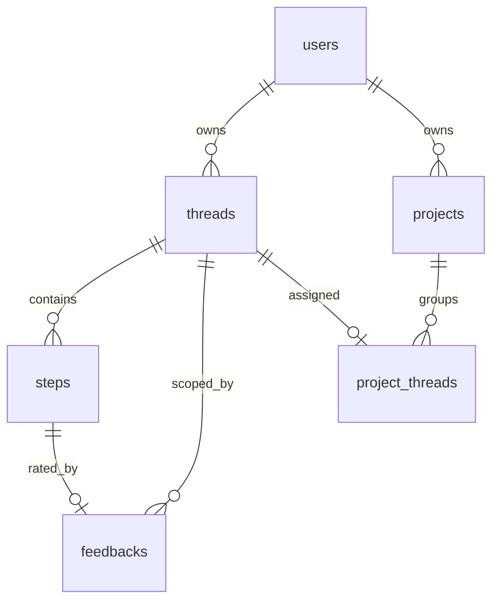

# Đối chiếu §Thiết kế cơ sở dữ liệu — phiên bản tối giản (code-used fields)

## Nguyên tắc mới (theo yêu cầu)

- **Chỉ vẽ và liệt kê trường mà code ứng dụng thực sự đọc/ghi** — không sao chép schema Chainlit đầy đủ.
- Cột Chainlit tồn tại nhưng **không có logic nghiệp vụ** (`streaming`, `tags`, `userIdentifier`, `waitForAnswer`, `generation`, …) → **bỏ qua hoàn toàn**.
- Bảng Chainlit **không được app dùng** (`elements` — chỉ cascade delete khi xóa thread) → **không đưa vào đồ án**.
- Bảng **mở rộng có API/UI** (`projects`, `project_threads`) → **đưa vào** vì frontend sidebar và [`adapter/projects.py`](G:/Agentic GraphRAG Chatbot luật/adapter/projects.py) dùng trực tiếp.

---

## Kết luận đối chiếu (rút gọn)

| Hạng mục | Đánh giá |
|---|---|
| Neo4j + PostgreSQL hai tầng | **Đúng** |
| 4 bảng lõi Users/Threads/Steps/Feedbacks | **Đúng hướng**, cần sửa tên trường + bổ sung `metadata` |
| Thiếu `projects` / `project_threads` | **Cần thêm** — có feature quản lý dự án |
| Mô tả persist không điều kiện | **Sai** — guest không persist; trace agent chỉ khi Expert mode |
| Liệt kê cột Chainlit thừa | **Không cần** — đã loại theo nguyên tắc trên |

---

## Schema tối giản — trường thực sự dùng trong code

### `users` — giữ nguyên bảng hiện tại (đã đúng)

| Trường | Kiểu | Dùng ở đâu |
|---|---|---|
| `id` | UUID | PK, FK threads/projects |
| `identifier` | TEXT | OAuth email/login; guest `guest:<uuid>` ([`main.py::oauth_callback`](G:/Agentic GraphRAG Chatbot luật/presentation/main.py), [`guest.py`](G:/Agentic GraphRAG Chatbot luật/adapter/guest.py)) |
| `metadata` | JSONB | `name`, `avatar_url`, `provider`; guest: `auth_mode: guest` |
| `createdAt` | TEXT | Chainlit persist user |

### `threads` — **không thêm** `userIdentifier`, `tags`, `metadata`

| Trường | Kiểu | Dùng ở đâu |
|---|---|---|
| `id` | UUID | PK |
| `userId` | UUID | FK → users; lọc ownership ([`projects.py::_list_threads`](G:/Agentic GraphRAG Chatbot luật/adapter/projects.py)) |
| `name` | TEXT | Tên phiên (câu hỏi đầu) |
| `createdAt` | TEXT | Sắp xếp/lọc sidebar; tính `updatedAt` qua join steps |

### `steps` — **trọng tâm sửa**

| Trường | Kiểu | Dùng ở đâu |
|---|---|---|
| `id` | UUID | PK; `forId` feedback; `compare_id` |
| `threadId` | UUID | FK → threads (**đổi tên từ `thread_id` sai trong `.tex`**) |
| `parentId` | UUID | Cây step lồng nhau (Router → Retriever con) |
| `name` | TEXT | `"Router Agent"`, `"Retriever: …"`, `"Tổng hợp đáp án"`, … |
| `type` | TEXT | Chỉ các loại **app gán/đọc**: `user_message`, `assistant_message`, `tool`, `llm`, `run` |
| `input` | TEXT | Câu hỏi Router; args retriever; context gửi LLM |
| `output` | TEXT | Tin nhắn user/assistant; context hiển thị UI |
| `metadata` | JSONB | **Bắt buộc mô tả** — xem khóa JSON bên dưới |
| `createdAt` | TEXT | Thứ tự restore; sort activity thread ([`projects.py`](G:/Agentic GraphRAG Chatbot luật/adapter/projects.py)) |

**Khóa JSON trong `steps.metadata` (chỉ liệt kê cái code ghi/đọc):**

| Khóa | Step type | File |
|---|---|---|
| `retrieval_memory_entries` | assistant / tool | [`main.py`](G:/Agentic GraphRAG Chatbot luật/presentation/main.py), [`conversation_context.py::restore_conversation_state`](G:/Agentic GraphRAG Chatbot luật/application/conversation_context.py) |
| `turn_anchor` | assistant / tool | cùng trên |
| `kg_version` | assistant / tool | cùng trên — invalidate cache reuse |
| `legal_warnings` | assistant | [`main.py` L600–603](G:/Agentic GraphRAG Chatbot luật/presentation/main.py) |
| `compare_available`, `compare_id` | assistant | [`compare_actions.py`](G:/Agentic GraphRAG Chatbot luật/presentation/compare_actions.py) |
| `tool_response`, `raw_result`, `retrieval_debug` | tool (Router) | [`main.py` L442–446](G:/Agentic GraphRAG Chatbot luật/presentation/main.py), [`router.py`](G:/Agentic GraphRAG Chatbot luật/application/router.py) |

**Loại `type` — chỉ mô tả 5 loại app dùng**, không liệt kê `undefined`/`command`/… của Chainlit:

- `user_message` / `assistant_message` — hội thoại; restore [`restore_conversation_state`](G:/Agentic GraphRAG Chatbot luật/application/conversation_context.py)
- `tool` — Router Agent (Expert mode)
- `llm` — bước Tổng hợp đáp án (Expert mode)
- `run` — step cha so sánh baseline ([`compare_actions.py`](G:/Agentic GraphRAG Chatbot luật/presentation/compare_actions.py))

**Điều kiện ghi step agent:** chỉ khi **Expert mode** bật ([`main.py::_route_with_optional_steps`](G:/Agentic GraphRAG Chatbot luật/presentation/main.py), [`router.py::_execute_tool_call`](G:/Agentic GraphRAG Chatbot luật/application/router.py)). Tin nhắn user/assistant vẫn persist qua Chainlit bình thường.

### `feedbacks` — giữ 5 trường hiện tại (đã đúng)

| Trường | Kiểu | Dùng ở đâu |
|---|---|---|
| `id` | UUID | PK |
| `threadId` | UUID | FK scope (Chainlit + guest guard) |
| `forId` | UUID | FK → step assistant được chấm điểm |
| `value` | INT | 0 Dislike / 1 Like — [`FeedbackButtons.tsx`](G:/Agentic GraphRAG Chatbot luật/frontend/src/components/chat/Messages/Message/Buttons/FeedbackButtons.tsx) |
| `comment` | TEXT | Nhận xét chi tiết |

**Quan hệ semantic:** Steps → Feedbacks (qua `forId`), không chỉ Threads → Feedbacks.

### `projects` + `project_threads` — **thêm mới**

**`projects`:**

| Trường | Kiểu | Dùng ở đâu |
|---|---|---|
| `id` | UUID | PK |
| `name` | TEXT | Tên dự án |
| `userId` | UUID | FK → users |
| `createdAt` | TEXT | Hiển thị sidebar |
| `updatedAt` | TEXT | Sort danh sách project |

**`project_threads`:**

| Trường | Kiểu | Dùng ở đâu |
|---|---|---|
| `threadId` | UUID | PK, FK → threads |
| `projectId` | UUID | FK → projects |
| `createdAt` | TEXT | Thời điểm gán |

Nguồn: [`adapter/projects.py::PROJECTS_MIGRATION_SQL`](G:/Agentic GraphRAG Chatbot luật/adapter/projects.py), [`frontend/.../ThreadList.tsx`](G:/Agentic GraphRAG Chatbot luật/frontend/src/components/LeftSidebar/ThreadList.tsx).

---

## Sơ đồ ER đề xuất (6 thực thể, trường tối giản)

**Không vẽ:** `elements`, cột Chainlit không dùng.

---

## Ràng buộc vận hành (bổ sung text, không phải cột DB)

1. **Guest** ([`GuestAwareSQLAlchemyDataLayer`](G:/Agentic GraphRAG Chatbot luật/adapter/data_layer.py)): không ghi thread/step/feedback; không resume sidebar.
2. **Expert mode**: step `tool`/`llm`/Retriever mới persist trace agent.
3. **Neo4j**: defer Ch5 — không đổi.
4. **Viz snapshots** (`data/viz_snapshots/`): filesystem, TTL 7 ngày — footnote tùy chọn, không ER.

---

## Việc cần sửa trong `.tex`

File: [`4_Ket_qua_thuc_nghiem.tex`](G:/Agentic GraphRAG Chatbot luật/ĐATN_20225919_Lê_Thái_Sơn_Chatbot_tư_vấn_luật_hôn_nhân_gia_đình/Chuong/4_Ket_qua_thuc_nghiem.tex) L303–395

1. **Mở đầu**: persist có điều kiện (login + DATABASE_URL); guest; expert mode.
2. **Bảng thực thể**: 6 dòng (thêm Projects, Project_threads).
3. **Bảng Users**: giữ nguyên.
4. **Bảng Threads**: giữ 4 trường (`id`, `userId`, `name`, `createdAt`) — **không thêm** cột Chainlit thừa.
5. **Bảng Steps**:
   - `thread_id` → `threadId`
   - Thêm `metadata` (JSONB) + mô tả khóa JSON ở trên
   - Thêm `createdAt`
   - `type`: 5 loại code-used + ghi chú expert mode
6. **Bảng Feedbacks**: giữ; sửa mô tả quan hệ qua `forId`.
7. **Thêm** bảng Projects và Project_threads (cột tối giản).
8. **Hình ER** (`Hinhve/Sơ đồ ER cho session chat.png`): vẽ lại 6 thực thể + quan hệ trên; mỗi thực thể chỉ các trường trong bảng tối giản.
9. **Build**: `scripts/build-thesis.ps1`.

---

## Đã loại khỏi phạm vi (cố ý)

| Mục | Lý do |
|---|---|
| `elements` | App không đọc/ghi field nào |
| `threads.userIdentifier`, `tags`, `metadata` | Không có logic app |
| `steps.streaming`, `showInput`, `generation`, `language`, `command`, `modes`, … | Chainlit UI nội bộ |
| Retriever `type="undefined"` | Default Chainlit, không cần mô tả schema |
| Toàn bộ cột Neo4j | Đã defer Ch5 |
