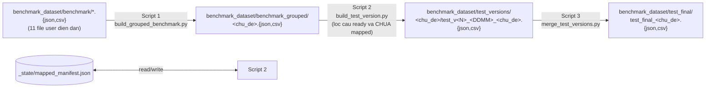

# Kế hoạch pipeline benchmark + test versions

## 1. Tóm tắt quyết định đã chốt
- **Tiêu chí "câu ready"**: cả 8 trường `loai_cau_hoi`, `van_ban_phap_luat_lien_quan`, `tinh_trang_hieu_luc`, `can_cu_phap_ly_chinh`, `can_cu_phap_ly_bo_tro`, `van_ban_huong_dan_sua_doi_bo_sung_thay_the`, `can_cu_khong_nen_ap_dung`, `quan_he_chong_cheo_mau_thuan` đều non-empty.
- **Tên file test**: `test_v<N>_<DDMM>_<chu_de>.{json,csv}` (1705 = 17/05).
- **Cấu trúc thư mục mới**:
  - `benchmark_dataset/benchmark_grouped/` chứa file benchmark "đông cứng" gộp theo `chu_de_phap_ly`.
  - `benchmark_dataset/test_versions/<chu_de>/` chứa các file test phiên bản từng ngày của chủ đề đó.
  - `benchmark_dataset/test_final/` chứa file test gộp cuối cùng (khi xong toàn bộ).
  - `benchmark_dataset/_state/mapped_manifest.json` lưu lịch sử ánh xạ để incremental.
- **Question ID**: SHA-1 ngắn của `question.strip()` (đủ unique trong tập <10k câu, đồng thời ổn định không phụ thuộc thứ tự).
- **Định dạng output**: vừa JSON vừa CSV (giữ thói quen hiện tại trong `benchmark_dataset/benchmark/`).
- **Loại trừ** `qa_dieu_kien_ket_hon.{json,csv}` khỏi pipeline gộp (theo yêu cầu).

## 2. Schema file test (cột theo thứ tự)
```text
question, ground_truth, chatbot_answer,
chu_de_phap_ly, loai_cau_hoi,
van_ban_phap_luat_lien_quan, tinh_trang_hieu_luc,
can_cu_phap_ly_chinh, can_cu_phap_ly_bo_tro,
van_ban_huong_dan_sua_doi_bo_sung_thay_the,
can_cu_khong_nen_ap_dung, quan_he_chong_cheo_mau_thuan,
legal_citation_accuracy, so_can_cu_con_hieu_luc, tong_so_can_cu_duoc_neu_ra,
context, citation_prioritization_accuracy, co_loi_hieu_luc,
hallucination_rate, faithfulness, context_recall, answer_correctness
```
Các trường eval (`chatbot_answer`, `context`, `legal_citation_accuracy`, ... `answer_correctness`) script sẽ ghi là chuỗi rỗng `""` để bạn điền sau khi chạy chatbot/eval.

## 3. Schema manifest
File `benchmark_dataset/_state/mapped_manifest.json`:
```json
{
  "updated_at": "2026-05-17T11:39:00+07:00",
  "topics": {
    "dieu_kien_ket_hon": {
      "mapped_question_ids": ["a1b2c3...", "d4e5f6..."],
      "versions": [
        {
          "version": 1,
          "date": "1705",
          "files": [
            "test_versions/dieu_kien_ket_hon/test_v1_1705_dieu_kien_ket_hon.json",
            "test_versions/dieu_kien_ket_hon/test_v1_1705_dieu_kien_ket_hon.csv"
          ],
          "added_question_ids": ["a1b2c3..."]
        }
      ]
    }
  }
}
```
- `mapped_question_ids`: tập hợp tất cả câu đã từng ánh xạ (để tránh trùng).
- `versions[*].added_question_ids`: chỉ các câu MỚI trong version đó (để trace lại).

## 4. Sơ đồ data flow


## 5. Script 1 – `benchmark_dataset/scripts/build_grouped_benchmark.py`
**Mục đích**: gộp tất cả file trong [benchmark_dataset/benchmark](benchmark_dataset/benchmark) theo `chu_de_phap_ly`, output `benchmark_dataset/benchmark_grouped/<chu_de>.{json,csv}`.

**Logic**:
1. Đọc mọi `qa_*.json` trong `benchmark_dataset/benchmark/`, **bỏ qua** `qa_dieu_kien_ket_hon.json`, các file backup (`_pre_recovery_backup_*`), và các script `_*.py`.
2. Concat thành 1 DataFrame, drop dòng có `chu_de_phap_ly` rỗng (cảnh báo ra console).
3. Drop duplicate theo `question` (giữ bản đầu, in cảnh báo nếu có).
4. `groupby('chu_de_phap_ly')` → ghi `benchmark_grouped/<chu_de>.json` và `.csv` cho từng nhóm.
5. In summary: mỗi chủ đề có bao nhiêu câu.

**Idempotent**: chạy bao nhiêu lần cũng cho cùng output (sẽ ghi đè file grouped). Manifest KHÔNG bị động vào.

## 6. Script 2 – `benchmark_dataset/scripts/build_test_version.py`
**Mục đích**: tạo file test version mới cho mỗi chủ đề, chỉ chứa các câu vừa "ready" và chưa từng ánh xạ.

**CLI tham số**:
- `--topic <chu_de>` (tuỳ chọn, mặc định: làm cho TẤT CẢ chủ đề có câu mới)
- `--date <DDMM>` (mặc định: hôm nay)
- `--dry-run` (in xem sẽ ánh xạ những câu nào, không ghi file)

**Logic**:
1. Load `_state/mapped_manifest.json` (tạo mới nếu chưa có).
2. Với mỗi file trong `benchmark_grouped/<chu_de>.json`:
   - Tính `question_id = sha1(question.strip())[:12]` cho từng câu.
   - Lọc câu "ready" = tất cả 8 trường tuỳ chọn non-empty (trim, loại "nan").
   - Lọc tiếp câu CHƯA có trong `manifest.topics[chu_de].mapped_question_ids`.
   - Nếu 0 câu mới → skip chủ đề đó, in log.
   - Nếu có ≥1 câu mới:
     - Xác định `version = max(versions).version + 1` (hoặc 1 nếu chưa có).
     - Tạo DataFrame với 22 cột schema mục 2 (cột eval = `""`).
     - Ghi `test_versions/<chu_de>/test_v<N>_<DDMM>_<chu_de>.{json,csv}`.
     - Cập nhật manifest: append vào `mapped_question_ids` và push version mới vào `versions`.
3. Save lại manifest (ghi atomic: write tmp → rename).

**Edge cases**:
- Nếu user sửa lại 1 câu đã ánh xạ → `question_id` đổi → câu bị coi là "mới" và ánh xạ lại. Đây là behavior mong muốn (sửa = tạo lại entry). Sẽ cảnh báo trong README script.
- Nếu chạy 2 lần cùng ngày mà có câu mới → tạo `test_v<N+1>_<DDMM>...` (version vẫn tăng) để không ghi đè.

## 7. Script 3 – `benchmark_dataset/scripts/merge_test_versions.py`
**Mục đích**: gộp tất cả `test_v*_<chu_de>.json` của một chủ đề (hoặc tất cả chủ đề) thành 1 file cuối.

**CLI**: `--topic <chu_de>` (tuỳ chọn, mặc định: all).

**Logic**:
1. Với mỗi chủ đề, đọc toàn bộ file trong `test_versions/<chu_de>/`, sort theo (version asc).
2. Concat → drop duplicate theo `question_id` (giữ bản MỚI NHẤT, vì user có thể đã update giá trị ở version sau).
3. Ghi `benchmark_dataset/test_final/test_final_<chu_de>.{json,csv}`.
4. In summary: số câu trước/sau dedup mỗi chủ đề.

## 8. Workflow hàng ngày của bạn
1. Mở các file `qa_*.json` trong [benchmark_dataset/benchmark](benchmark_dataset/benchmark) và điền đủ 8 trường cho 10-20 câu.
2. Chạy `python benchmark_dataset/scripts/build_grouped_benchmark.py` (regen các file grouped).
3. Chạy `python benchmark_dataset/scripts/build_test_version.py` (tự tạo `test_v<N>_<DDMM>_<chu_de>` cho mọi chủ đề có câu mới).
4. Bạn điền `chatbot_answer`, `context`, các metric eval trong file test mới được tạo.
5. Khi đã xong toàn bộ, chạy `python benchmark_dataset/scripts/merge_test_versions.py` để gộp ra file cuối cùng trong `test_final/`.

## 9. Bonus an toàn (đề xuất gộp luôn)
- Mỗi script tự tạo backup vào `benchmark_dataset/_state/backups/<timestamp>/` trước khi ghi đè (chỉ cho `benchmark_grouped/` và `manifest`).
- Sửa `benchmark_dataset/benchmark/cleanup_columns.py` để KHÔNG còn regenerate JSON từ CSV nữa (đây là nguyên nhân gây mất dữ liệu lần trước) — chuyển logic sang đọc-ghi cùng định dạng (JSON đọc JSON, CSV đọc CSV).
- Thêm `.gitignore` cho `benchmark_dataset/_state/backups/` để không làm bẩn git history.

## 10. Câu hỏi tôi muốn xác nhận trước khi code
1. **Bonus #9 có làm luôn không** (sửa `cleanup_columns.py` + thêm backup tự động)? Mạnh tay khuyến nghị làm vì lần trước đã mất công khôi phục.
2. **Khi merge cuối cùng** (Script 3), nếu một `question_id` xuất hiện ở nhiều version (do bạn sửa lại sau), giữ bản **MỚI NHẤT** có ổn không? Hay bạn muốn giữ bản đầu tiên?
3. **Manifest file** có nên commit vào git không? Khuyến nghị **CÓ** (để máy khác cùng tiếp tục được). Cần xác nhận.
